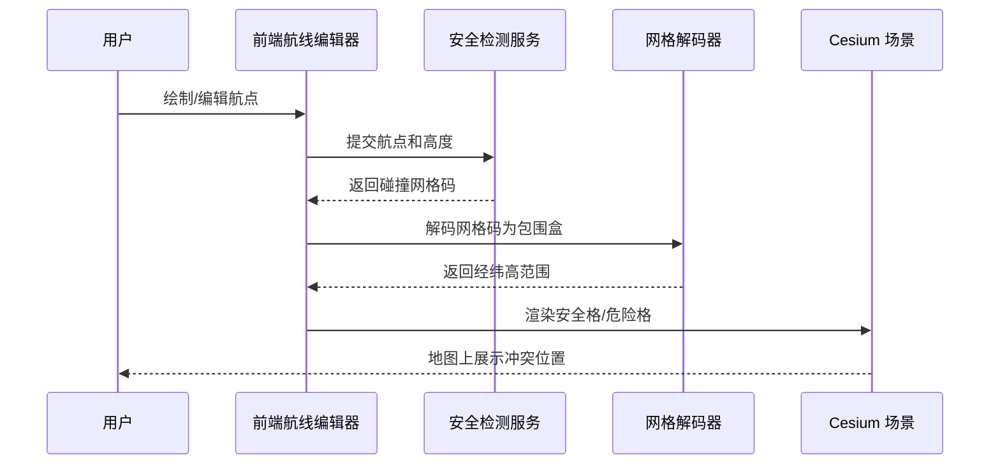
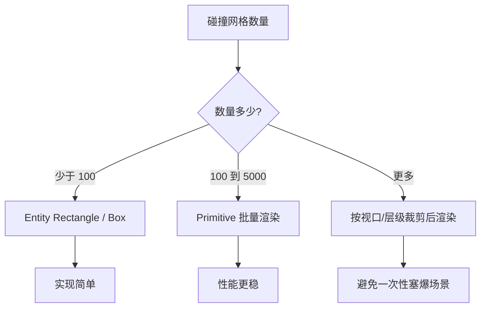
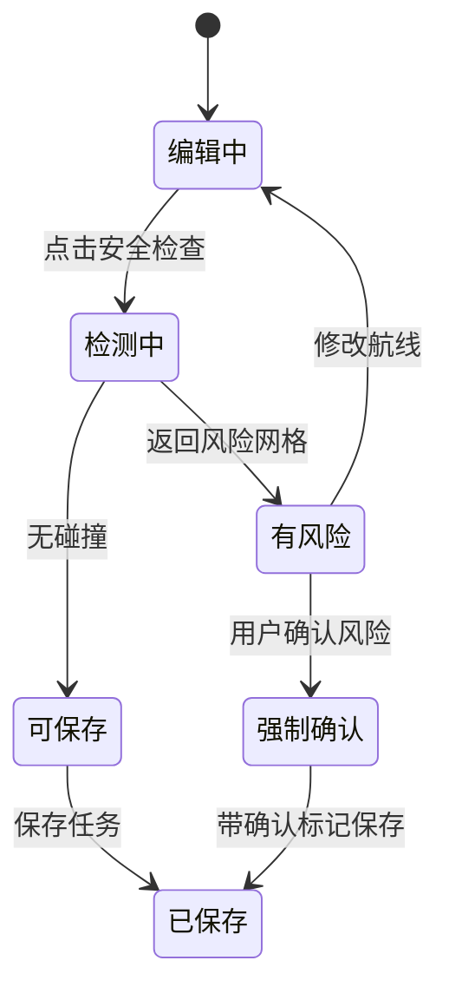
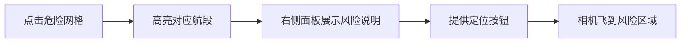

航线规划里最怕「看起来能飞，保存后才发现不能飞」。如果后端只返回一组碰撞网格码，前端直接弹一句「航线不安全」，用户很难理解问题出在哪。更好的体验是：**把安全格、危险格直接画到三维地图上**，让用户知道是哪一段航线、哪一片空域出了问题。

本文基于一个脱敏后的无人机三维操控台实践，整理 BDC3D 网格碰撞结果在前端的可视化思路。文中不涉及具体空域规则、真实坐标和项目接口，只讨论通用实现。

## 一、问题背景

航线保存前通常要做几类检查：

- 是否穿过禁飞区
- 是否超过高度限制
- 是否与已有航线/任务冲突
- 是否存在不可达或风险区域

后端可以做复杂空间计算，但前端要解决另一个问题：**让用户看懂结果**。

一个典型返回可能长这样：

```js
{
  safe: false,
  collisionCells: ['***脱敏网格码***', '***脱敏网格码***'],
  warningCells: ['***脱敏网格码***']
}
```

如果只展示文本，用户需要凭经验猜是哪一段航线出问题；如果把网格画出来，问题就直观很多。

## 二、整体流程



这个链路里，前端的重点有两个：

1. 把网格码解码成空间范围
2. 把空间范围高性能地画到 Cesium 场景里

## 三、数据模型设计

为了脱离后端字段细节，前端可以收敛成统一结构：

```js
const gridCell = {
  id: 'cell-id',
  level: 18,
  bounds: {
    west: 113.1,
    south: 23.1,
    east: 113.2,
    north: 23.2,
    minHeight: 0,
    maxHeight: 120
  },
  status: 'danger' // safe | warning | danger
};
```

后续渲染层只认这个结构，不关心 BDC3D 原始编码细节。这样即使后端未来换一种编码，前端也只改解码器。

## 四、网格码解码层

建议把解码逻辑做成纯函数：

```js
function decodeGridCode(code) {
  // 真实项目里这里会包含进制、层级和空间范围换算
  // 对外文章只保留结构，不暴露具体编码规则
  return {
    level: getLevel(code),
    bounds: getBounds(code)
  };
}

function normalizeCollisionResult(result) {
  return [
    ...result.collisionCells.map((code) => ({
      id: code,
      ...decodeGridCode(code),
      status: 'danger'
    })),
    ...result.warningCells.map((code) => ({
      id: code,
      ...decodeGridCode(code),
      status: 'warning'
    }))
  ];
}
```

这里要注意两点：

- 解码器不碰 Cesium，只负责数据转换
- 渲染器不碰原始 code，只负责画标准 cell

## 五、渲染方式选择

少量网格可以用 Entity；网格多了建议用 Primitive 或批量 Geometry。



渲染样式可以按状态区分：

```js
const COLOR_MAP = {
  safe: Cesium.Color.GREEN.withAlpha(0.15),
  warning: Cesium.Color.YELLOW.withAlpha(0.25),
  danger: Cesium.Color.RED.withAlpha(0.35)
};
```

## 六、交互状态机

航线编辑和检测展示不要混成一团。推荐用明确状态管理：



前端可以把「有风险但允许确认保存」和「绝对禁止保存」分开，否则产品体验会很僵。

## 七、性能细节

| 问题 | 建议 |
|---|---|
| 检测结果重复 | 按网格 ID 去重 |
| 多次检测残留 | 每次检测前清理旧 collection |
| 透明面太多 | 限制 alpha，必要时只画边框 |
| 航线编辑频繁触发 | 防抖检测，避免每拖一点请求一次 |
| 网格层级不同 | 同层级分组渲染，便于统一样式 |

清理逻辑要显式写：

```js
function clearCollisionLayer(viewer, layer) {
  if (!layer) return;
  viewer.scene.primitives.remove(layer);
}
```

## 八、用户体验优化

只画红格还不够，最好联动航线列表和提示：



这样用户不是「看到一堆红块」，而是能马上定位到要改的航点。

## 九、小结

航线安全检测不应该停留在「接口返回 true/false」。前端把网格码解码、分组、上色、联动航线编辑器后，用户才能真正理解风险。

这类功能的关键不在某个 Cesium API，而在三层边界：

- 解码层：原始网格码 → 标准空间范围
- 渲染层：空间范围 → 地图图元
- 交互层：风险结果 → 航线编辑反馈

边界清楚后，无论换网格编码、换检测服务，前端主流程都能保持稳定。
