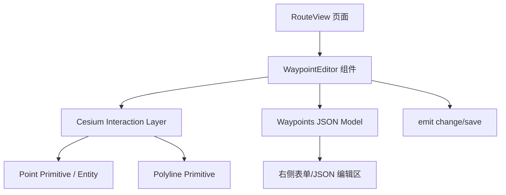
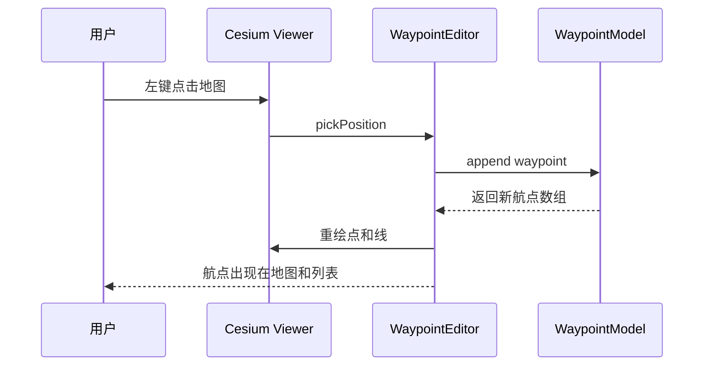
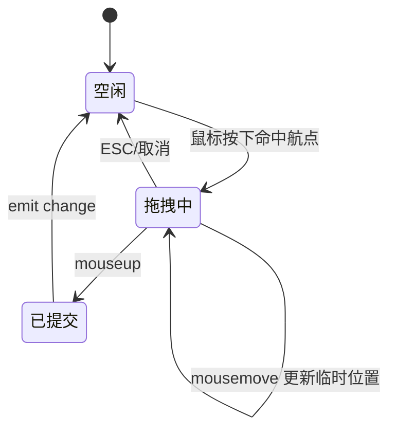
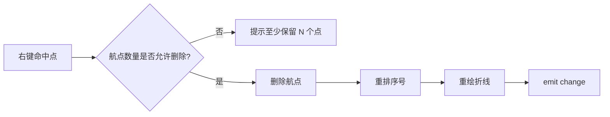
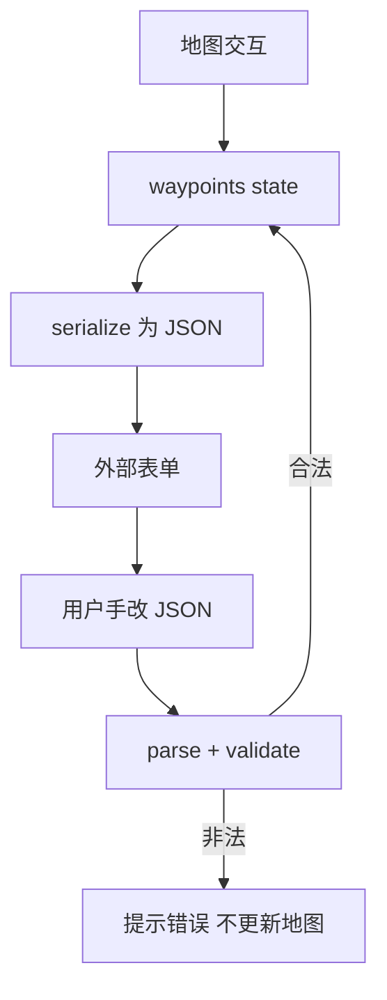

航线规划是无人机巡检平台里非常核心的交互。最简单的方案是让用户在表单里填写经纬度 JSON，但这对普通用户并不友好。更好的做法是做一个三维航点编辑器：**地图上点选添加航点，拖拽调整位置，右键删除航点，同时与 JSON 表单保持双向同步**。

本文整理一个脱敏后的 Cesium 航点编辑器设计，不涉及真实任务接口和坐标数据，只讨论前端组件如何拆。

## 一、航点编辑器要解决什么

航点编辑器看起来只是「点几个点」，实际至少包含这些能力：

- 点击地图新增航点
- 拖拽航点修改经纬度
- 右键删除航点
- 航点列表与地图同步
- 外部 JSON 修改后回写地图
- 保存前校验高度、数量、闭合规则

如果没有清晰的状态边界，很容易出现「地图改了列表没改」「JSON 改了地图没动」「拖拽时重复触发保存」这类问题。

## 二、组件分层



组件要尽量保持单一职责：

- 页面负责拉任务、保存任务
- 编辑器负责地图交互和航点模型
- Cesium 层负责点、线、拖拽事件
- JSON 层负责序列化与反序列化

## 三、航点数据模型

```js
const waypoint = {
  id: 'wp-1',
  lon: 113.123,
  lat: 23.456,
  alt: 120,
  speed: 8,
  action: []
};
```

推荐给每个航点生成稳定 `id`，不要只依赖数组下标。拖拽、删除、排序都可能改变下标，但 `id` 应该稳定。

## 四、地图点击新增航点



核心代码思路：

```js
handler.setInputAction((movement) => {
  const cartesian = viewer.scene.pickPosition(movement.position);
  if (!cartesian) return;

  const cartographic = Cesium.Cartographic.fromCartesian(cartesian);
  addWaypoint({
    lon: Cesium.Math.toDegrees(cartographic.longitude),
    lat: Cesium.Math.toDegrees(cartographic.latitude),
    alt: cartographic.height
  });
}, Cesium.ScreenSpaceEventType.LEFT_CLICK);
```

## 五、拖拽修改航点

拖拽是最容易写乱的部分。建议用状态机描述：



拖拽期间只更新临时位置，`mouseup` 后再统一触发 `change`，避免每移动一像素就触发保存或校验。

```js
function updateDraggingPoint(position) {
  const cartesian = viewer.scene.pickPosition(position);
  if (!cartesian || !draggingId) return;

  const next = toWaypoint(cartesian);
  waypointMap.set(draggingId, {
    ...waypointMap.get(draggingId),
    ...next
  });

  redrawPolyline();
}
```

## 六、右键删除航点



删除时最好不要直接 `splice(index)` 后把 index 当 id 使用；否则重排会让旧事件引用错对象。稳定 ID 仍然是关键。

## 七、JSON 双向同步

航点编辑器通常要支持「表单改地图」和「地图改表单」：



为了防止循环更新，可以加来源标记：

```js
let updatingFromMap = false;
let updatingFromJson = false;

function onMapChange(nextWaypoints) {
  if (updatingFromJson) return;
  updatingFromMap = true;
  emit('update:modelValue', serialize(nextWaypoints));
  updatingFromMap = false;
}

function onJsonChange(json) {
  if (updatingFromMap) return;
  const next = parseWaypoints(json);
  updateMap(next);
}
```

## 八、保存前校验

| 校验项 | 说明 |
|---|---|
| 航点数量 | 至少 2 个点才能形成路线 |
| 经纬度范围 | 防止异常值 |
| 高度范围 | 避免负高或超过业务限制 |
| 相邻点距离 | 防止两个点重叠 |
| 航线安全 | 可接入禁飞区/碰撞检测 |

校验结果最好也能定位到具体航点：

```js
{
  valid: false,
  waypointId: 'wp-3',
  message: '高度超过允许范围'
}
```

## 九、销毁与资源清理

地图交互组件很容易内存泄漏。销毁时要清理：

- `ScreenSpaceEventHandler`
- 点、线 primitives/entities
- 临时拖拽状态
- 订阅事件

```js
function destroyEditor() {
  handler?.destroy();
  pointCollection && viewer.scene.primitives.remove(pointCollection);
  polylineCollection && viewer.scene.primitives.remove(polylineCollection);
  draggingId = null;
}
```

## 十、小结

一个可靠的 Cesium 航点编辑器，不只是把点画出来。它需要明确处理：

- 地图交互事件
- 航点数据模型
- JSON 双向同步
- 拖拽状态机
- 保存前校验
- 资源销毁

把这几层拆清楚后，后续增加「航点动作」「安全检测」「轨迹预览」「任务回放」都会顺很多。
