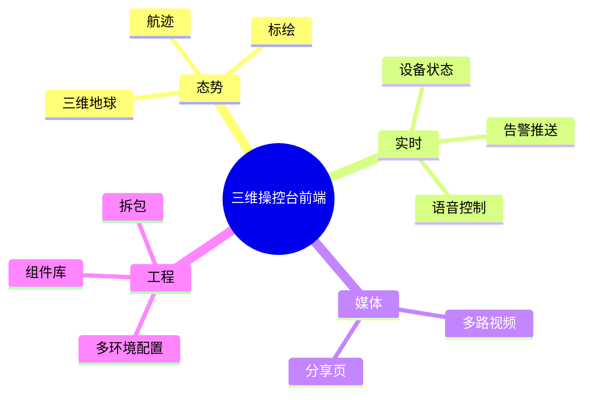
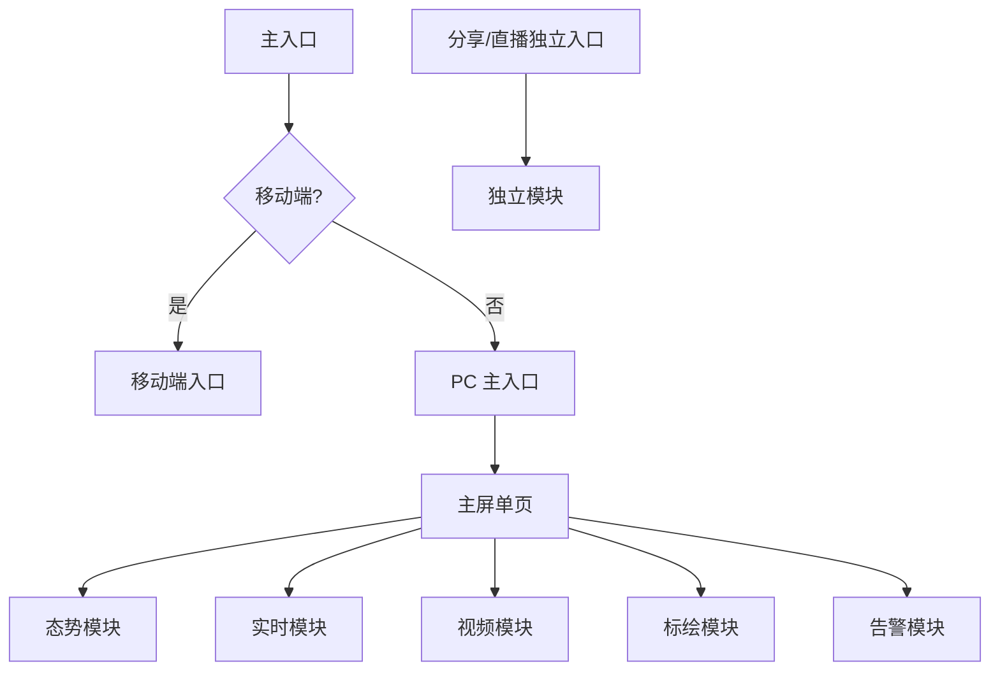
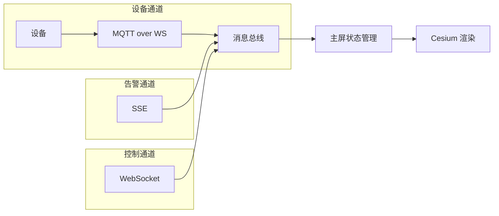
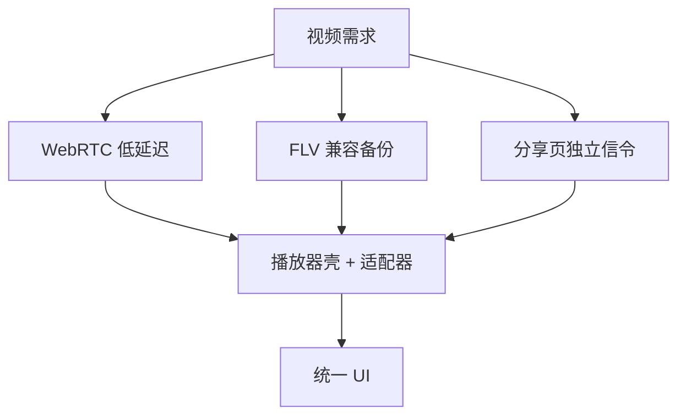
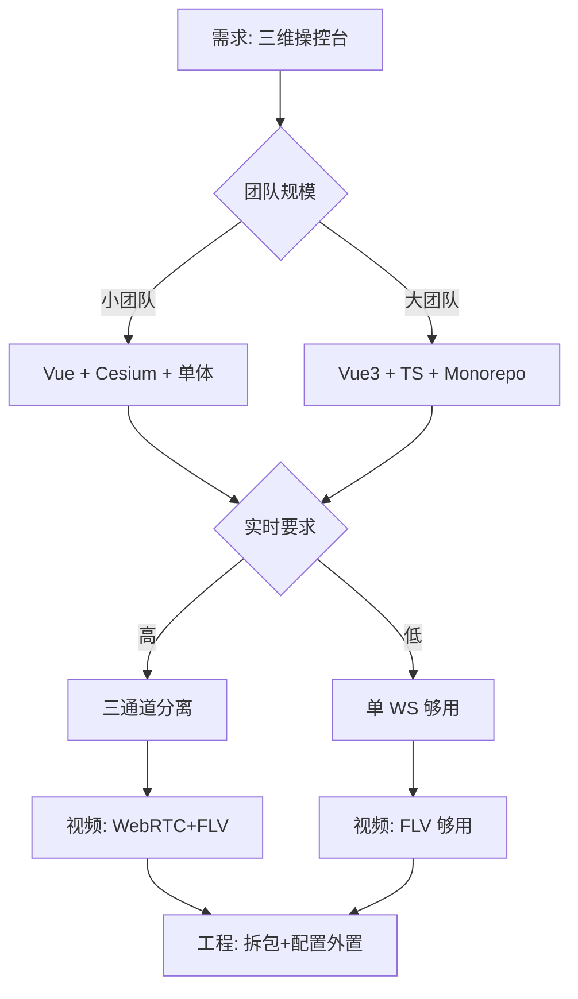

做应急或巡检类「三维操控台」时，前端选型会被四件事同时拉扯：**地图表现、实时性、视频能力、工程可维护性**。本文用脱敏后的经验，整理一版可讨论的选型笔记，便于同类项目开题。

## 一、能力地图



## 二、关键取舍

| 领域 | 常见选择 | 取舍说明 |
|---|---|---|
| 三维 | Cesium | 生态成熟；体积与首屏要用拆包换 |
| 框架 | Vue 2/3 均可 | 老项目保稳；新项目优先 Vue3+TS |
| 实时 | WS / MQTT over WS / SSE | 遥测与告警通道分离，避免一根绳子吊死 |
| 视频 | WebRTC + FLV 备份 | 低延迟与兼容性折中 |
| UI | 元件库 + 少量自研 | 地图主屏少用「后台表格思维」堆控件 |

## 三、架构建议



1. **主屏单页 + 模块开关**，而不是把飞控拆成几十个路由页
2. **地图工具库与业务组件分层**（航线、禁飞区、告警落点可测）
3. **分享/直播页独立入口**，减少权限与包体耦合
4. **配置外置**（行业/环境），代码仓库避免写死客户差异

## 四、实时通道分层



为什么分三条而不是一条：每条的可靠性要求、重连策略、消息频率都不同，混在一起一条断了全断。

## 五、视频能力分层



## 六、工程化分层

```mermaid
flowchart TB
  A[构建] --> B[splitChunks 拆包]
  B --> C[Cesium 独立 chunk]
  B --> D[媒体独立 chunk]
  A --> E[多环境配置外置]
  E --> F[config/index-{env}.js]
  F --> G[拷到 public/config]
  A --> H[私有组件库联调]
  H --> I[alias 到本地 monorepo]
```

## 七、不建议的做法

- 首屏同步加载三维、播放器、图表全家桶
- 在 URL 长期携带令牌
- 标绘与设备树全量 DOM 渲染
- 把客户定制直接 fork 主干却不回流配置化

## 八、选型决策流程



## 九、小结

操控台前端的胜负手，往往不在「用了哪个炫技库」，而在 **通道是否清晰、重模块是否懒加载、客户差异是否配置化**。选型时先画能力地图，再决定框架版本，不容易被单点技术偏好带跑。
