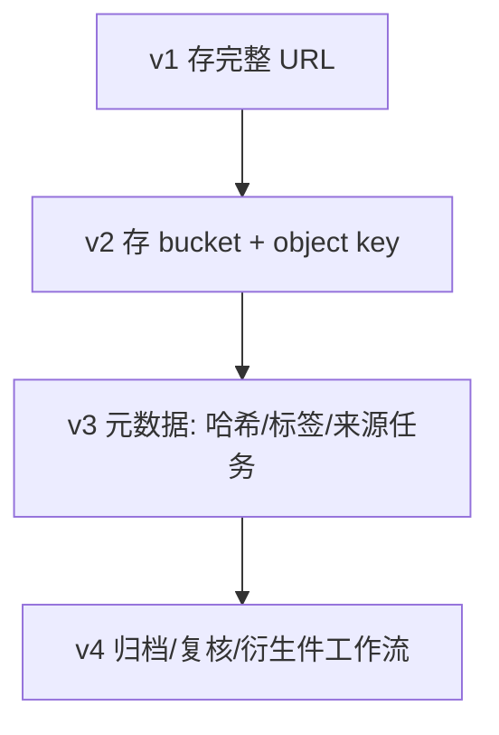
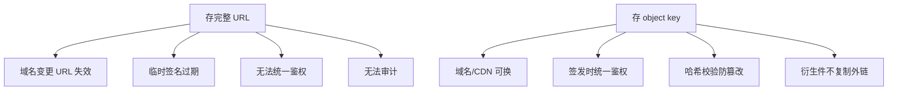
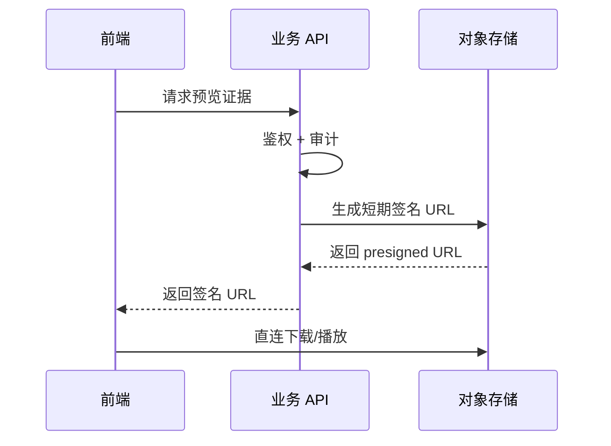
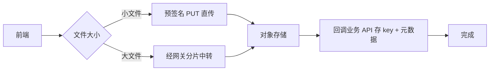
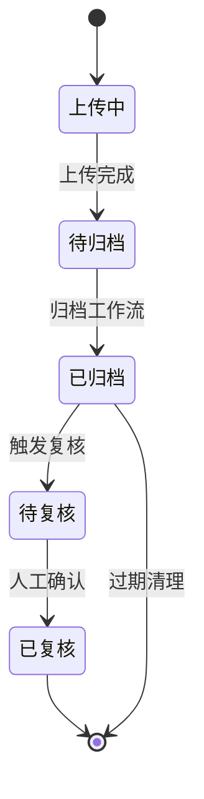
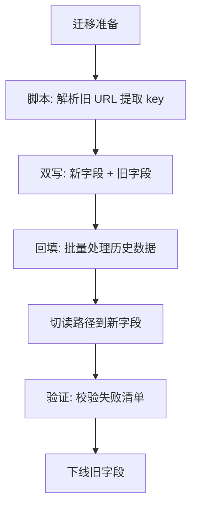
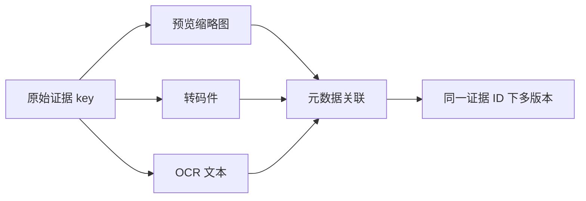

早期系统常把附件 URL 直接存进业务表。时间一长会出现：链路域名变更、临时签名过期、无法统一鉴权与审计。更稳的模型是：**库里只存对象键（object key）与元数据，读取时再签发短期访问**，并逐步演进成「证据中心」。

## 一、从附件到证据的演进

每一步都用迁移脚本批处理，旧字段只读兼容一段时间。

## 二、为什么 key 是真相源

好处：

- 域名、CDN、网关前缀都能换
- 权限在「签发 URL」时统一校验
- 便于做哈希校验、防篡改与审计日志
- 同一对象可衍生预览图、转码件，而不复制语义含糊的外链

## 三、读取路径

1. 前端要预览 → 调业务 API
2. 服务端鉴权 + 审计
3. 返回短 TTL 签名 URL
4. 前端直传下载/播放

## 四、上传路径

上传则用预签名 PUT 或经网关中转（看文件大小与网络环境）。

## 五、证据生命周期

## 六、迁移步骤

注意：

- 先双写/回填 key，再切读路径
- 记录校验失败清单，避免静默丢证据
- 归档任务可异步：热数据与冷数据分层

## 七、衍生件管理

衍生件用同一证据 ID 关联，不复制外链，避免「哪个才是原件」的歧义。

## 八、小结

「证据中心」不是多一个菜单，而是 **把文件从字符串 URL 提升为有元数据、有生命周期的对象**。对象键做真相源，是后面归档、复核、合规的地基。
