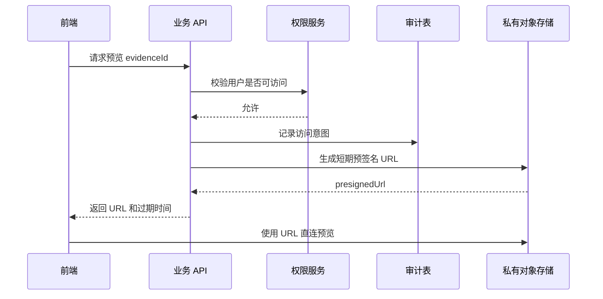
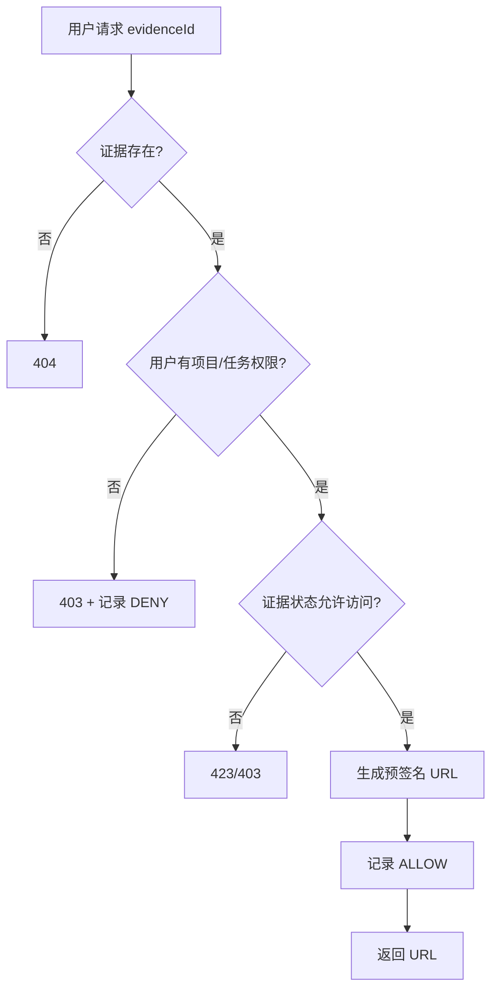
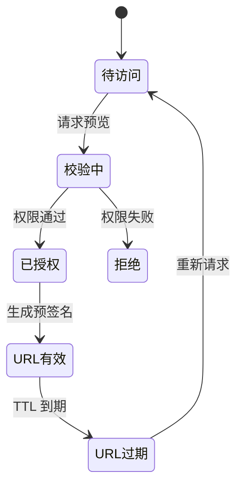

很多系统早期为了方便，会把对象存储桶设成 public，然后前端直接拿 URL 预览图片和视频。这样做开发快，但一旦文件变成「证据」，问题就来了：谁访问过、访问了多久、能不能撤回、链接被转发怎么办？

更稳的做法是：**证据桶保持私有，前端每次预览或下载都通过业务 API 换取短期预签名 URL，同时记录访问审计**。

本文用脱敏后的巡检/应急平台实践，整理这一访问模型。

## 一、为什么不能公开桶

公开桶的问题不止是「别人能看」：

| 风险 | 说明 |
|---|---|
| 链接可转发 | URL 一旦泄露，服务端无法控制 |
| 无访问审计 | 不知道谁看过证据 |
| 权限绕过 | 绕过业务系统的租户/项目权限 |
| 生命周期混乱 | 归档、删除、复核无法统一 |

证据类文件应该和普通静态资源分开治理。

## 二、总体链路



前端不直接拼对象存储地址，也不保存长期 URL。

## 三、预览和下载分开 TTL

预览和下载风险不同，TTL 可以分开：

| 场景 | TTL 建议 | 说明 |
|---|---|---|
| 图片预览 | 1-5 分钟 | 页面展示用 |
| 视频播放 | 5-15 分钟 | 需要留足缓冲 |
| 文件下载 | 1-3 分钟 | 下载按钮触发 |
| 批量导出 | 独立任务 | 不直接暴露原文件 URL |

```js
function getTtl(action) {
  if (action === 'preview') return 60 * 5;
  if (action === 'download') return 60 * 3;
  if (action === 'video') return 60 * 15;
  return 60;
}
```

## 四、访问审计字段

审计表不要记录过多敏感内容，但要能回答「谁在什么时候看了什么」：

```js
const accessLog = {
  evidenceId: 'evidence-001',
  userId: 'user-001',
  action: 'preview',
  ip: '***',
  userAgent: '***',
  result: 'ALLOW',
  createdAt: Date.now()
};
```

可以记录：

- 证据 ID
- 用户 ID
- 操作类型：preview/download
- 结果：ALLOW/DENY
- 时间、IP、UA 摘要

不要记录：

- 完整预签名 URL
- 长期 Token
- 敏感 Prompt 或业务正文

## 五、权限校验流程



注意：权限校验在业务 API 完成，而不是依赖对象存储桶策略完成。

## 六、前端使用方式

前端只拿一次性 URL：

```js
async function previewEvidence(id) {
  const { url, expiresAt } = await request(`/api/evidence/${id}/preview-url`);
  return {
    src: url,
    expiresAt
  };
}
```

对于图片预览，可以在 URL 快过期时重新请求；对于下载，点击按钮时再请求，不要页面加载时批量生成一堆下载链接。

## 七、状态机



预签名 URL 过期不是异常，而是安全设计的一部分。

## 八、常见坑

| 坑 | 处理 |
|---|---|
| 前端缓存 URL 太久 | 返回 expiresAt，过期前重取 |
| 日志里打印完整 URL | 禁止记录 query 签名 |
| 批量列表生成 URL | 只在点击预览时生成 |
| 公开桶和私有桶混用 | 证据桶一律私有 |
| 下载绕过审计 | 下载也必须先走 API |

## 九、小结

证据文件和普通图片最大的区别是：它需要权限、审计和生命周期管理。私有桶 + 预签名 URL + 访问审计，是把对象存储纳入业务治理的最小闭环。

这套模式不复杂，但能避免很多后期补安全账的问题。
