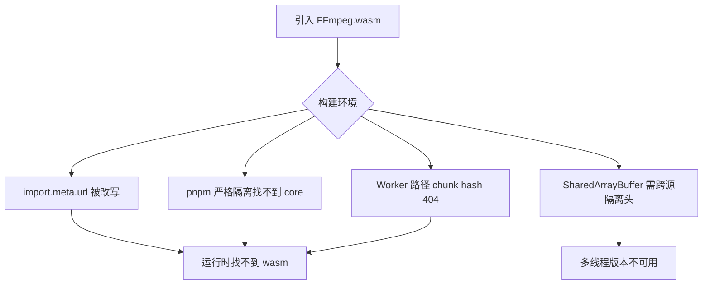
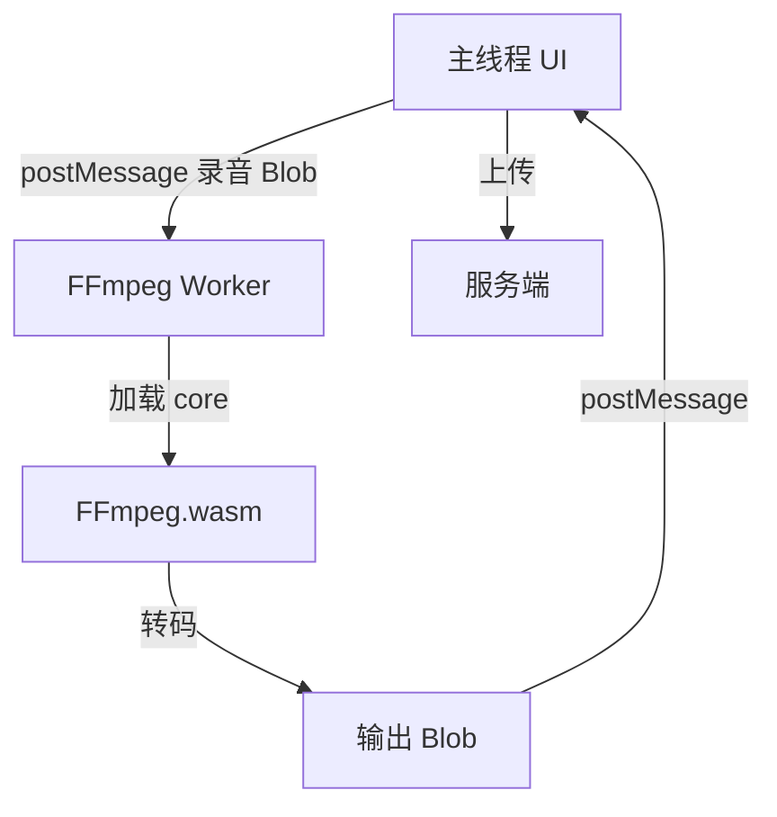
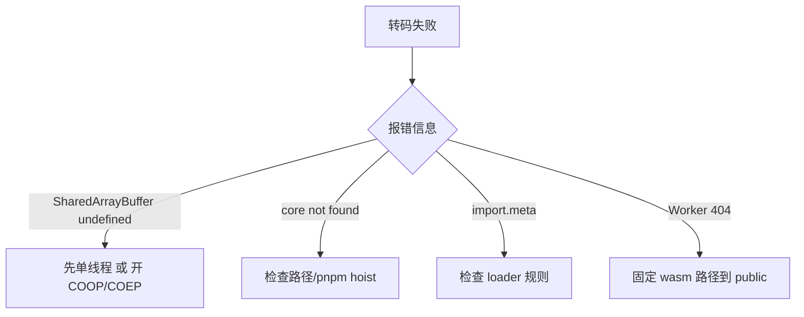

喊话、录音回传、浏览器端切片上传……有时后端只收固定封装格式，前端就需要在本地转码。`FFmpeg.wasm` 能办事，但在现代前端工程里经常死在 **Worker、SharedArrayBuffer、import.meta、包管理器 symlink** 上。本文记几条可复用的处理思路。

## 一、适用场景

- 录音得到 webm/wav，上传前转到指定格式
- 体积压缩后再走对象存储
- 弱网下减少服务端转码队列压力

不适用：超长音视频、需要硬件编码的重活（回服务器更合适）。

## 二、整体流程


## 三、为什么坑多



## 四、构建侧高频坑

### 4.1 import.meta.url 被错误改写

WASM/core 包依赖 `import.meta.url` 定位 worker。需在打包器里为相关包关闭错误转换，或增加专用 loader 规则。

```js
// vue.config.js
module.exports = {
  module: {
    rules: [
      {
        test: /ffmpeg\.core\.js$/,
        type: 'javascript/auto'
      }
    ]
  }
};
```

### 4.2 pnpm 严格隔离

幽灵依赖、symlink 导致运行时找不到 core 文件。用 `package.json` 显式声明依赖，必要时 `publicHoistPattern` 或拷贝静态资源到 `public/`。

```json
{
  "pnpm": {
    "publicHoistPattern": ["@ffmpeg/*"]
  }
}
```

### 4.3 COOP/COEP 与 SharedArrayBuffer

多线程版本需要跨源隔离头：

```nginx
add_header Cross-Origin-Opener-Policy "same-origin";
add_header Cross-Origin-Embedder-Policy "require-corp";
```

若短期不好开，先用单线程构建，换时间正确性。

### 4.4 路径与 CDN

worker 与 wasm 的公网路径要固定，避免 chunk hash 导致旧页面引用 404。推荐把 wasm 文件拷到 `public/ffmpeg/` 固定路径。

## 五、运行时架构



转码放 Web Worker，避免卡住 UI。

## 六、Worker 内调用示意

```js
// ffmpeg.worker.js
import { FFmpeg } from '@ffmpeg/ffmpeg';
import { fetchFile } from '@ffmpeg/util';

const ffmpeg = new FFmpeg();
await ffmpeg.load({
  coreURL: '/ffmpeg/ffmpeg-core.js',
  wasmURL: '/ffmpeg/ffmpeg-core.wasm'
});

self.onmessage = async (e) => {
  const { blob, target } = e.data;
  await ffmpeg.writeFile('input.webm', await fetchFile(blob));
  await ffmpeg.exec(['-i', 'input.webm', '-c:a', 'aac', 'output.mp4']);
  const data = await ffmpeg.readFile('output.mp4');
  self.postMessage({ blob: new Blob([data], { type: 'audio/mp4' }) });
};
```

## 七、运行时注意

- 显示进度与可取消（`ffmpeg.terminate()`）
- 大文件先分段，防止内存峰值把标签页打崩
- 转码完成后清理 WASM FS 临时文件

## 八、排障决策树



## 九、小结

FFmpeg.wasm 的业务代码往往不长，真正耗时的是 **工程集成**。先保证「单线程能转通 + 资源路径稳定」，再考虑多线程与极致体积；这在 Webpack 5 / pnpm 项目里是更稳的顺序。
