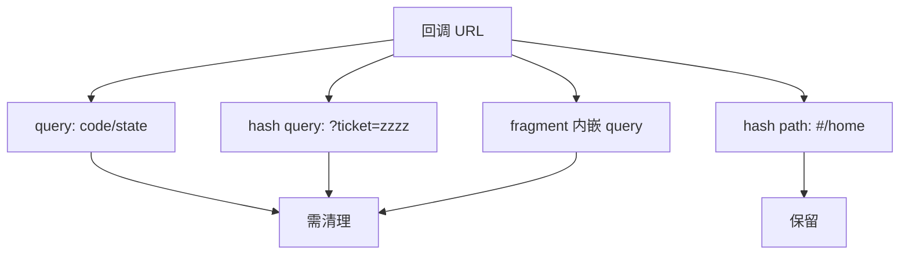
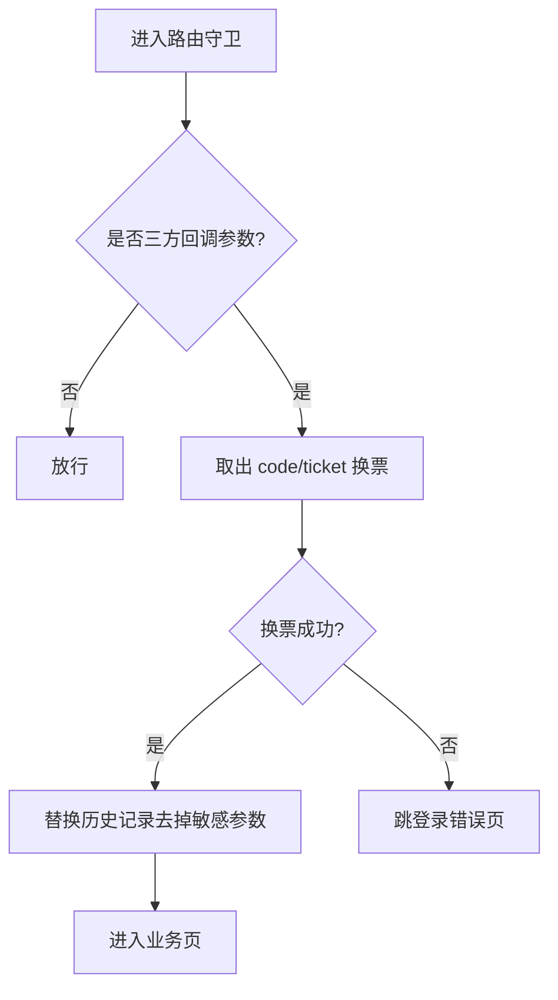
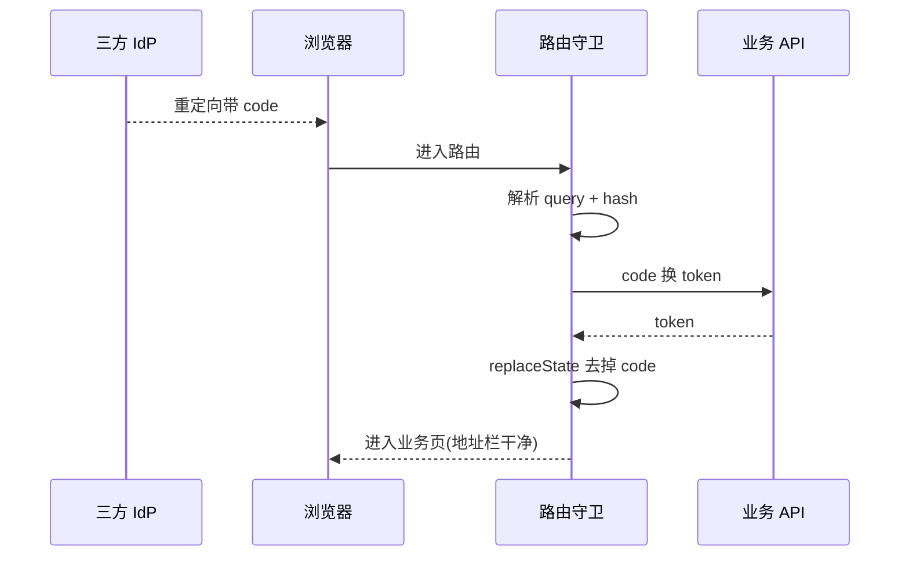
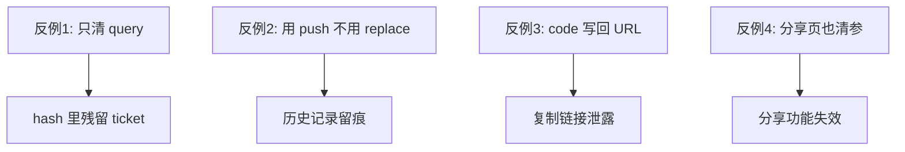

Hash 模式路由（`#/path`）在内网门户、老架构嵌入场景仍常见。三方登录回调时，**授权码、临时票据** 可能出现在 `?query` 里，也可能被门户塞进 hash 片段。若只清一边，地址栏和历史记录里会长期残留敏感参数。

## 一、问题长什么样

```text
https://app.example.com/?code=xxxx&state=yyyy#/home?ticket=zzzz
```

业务路由只看见 `#/home`，但：

- 整段 URL 可能被分析脚本采集
- 用户复制链接会把 code 一并发走
- 某些网关日志会记录 query

## 二、参数可能出现的四个位置



## 三、清理策略



要点：

1. **Query 与 Hash 内 query 都要解析**
2. 换票成功后用 `history.replaceState` / router `replace` **去掉** `code`、`ticket`、`state` 等
3. 白名单分享页不要走同一套「强制登录清参」逻辑

## 四、双通道解析示例

```js
function stripAuthParams(url) {
  const u = new URL(url, location.origin);
  // 清 query
  ['code', 'state', 'ticket', 'token'].forEach((k) => u.searchParams.delete(k));

  // 清 hash 内 query: #/path?ticket=...
  const [hashPath, hashQuery = ''] = u.hash.split('?');
  if (hashQuery) {
    const hp = new URLSearchParams(hashQuery);
    ['code', 'state', 'ticket', 'token'].forEach((k) => hp.delete(k));
    const q = hp.toString();
    u.hash = q ? `${hashPath}?${q}` : hashPath;
  }
  return u.pathname + u.search + u.hash;
}
```

## 五、路由守卫集成



```js
router.beforeEach(async (to, from, next) => {
  const code = to.query.code || parseHashQuery(to.hash).ticket;
  if (code) {
    try {
      await exchangeToken(code);
      const clean = stripAuthParams(location.href);
      router.replace(clean);
      next();
    } catch {
      next('/login-error');
    }
  } else {
    next();
  }
});
```

## 六、安全检查清单

- [ ] 换票后地址栏无 code/ticket
- [ ] 浏览器历史记录无敏感参数
- [ ] 分析脚本不会采集到 code
- [ ] 分享页路由不走清参逻辑
- [ ] code 只用一次，服务端销毁

## 七、常见反例



## 八、小结

Hash 路由下的 SSO 不是「能登录就行」，而是 **回调参数的生命周期要短**。双通道解析 + 立即 replace 清参，是成本很低、收益很高的安全细节。
