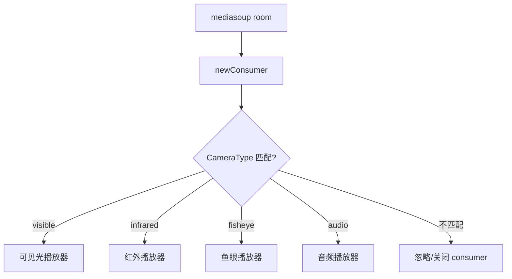
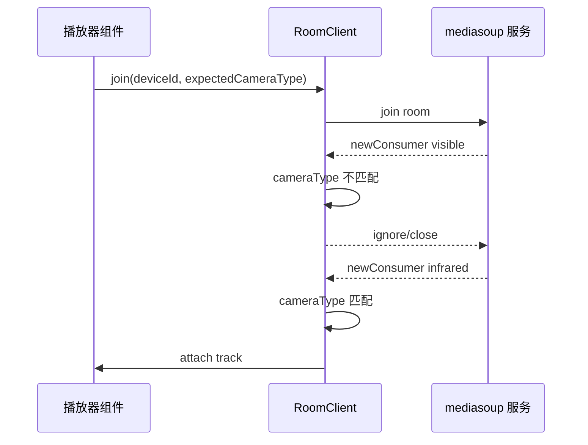
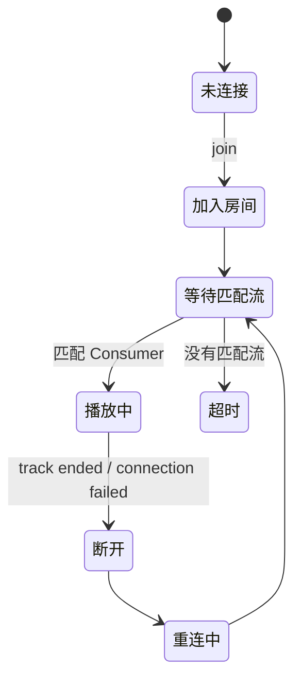
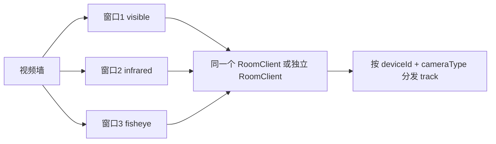

无人机或机库视频经常不是一路流：可见光、红外、鱼眼、喊话音频可能都在同一个房间或同一套信令里出现。前端如果「来一个 Consumer 就挂一个 video」，很容易把红外流挂到可见光窗口，或者鱼眼流被普通播放器消费。

本文整理一种 mediasoup 前端订阅策略：**按 CameraType 过滤 Consumer，让每个播放器只消费自己关心的媒体流**。

## 一、问题场景

同一个设备可能有多类媒体：

| 类型 | 用途 |
|---|---|
| visible | 普通可见光画面 |
| infrared | 夜间/热成像 |
| fisheye | 鱼眼全景 |
| audio | 语音/喊话 |

如果信令层只通知 `newConsumer`，前端必须自己判断这个 consumer 属于哪个窗口。

## 二、错误做法

```js
room.on('newConsumer', (consumer) => {
  // 反例：不判断类型，直接挂载
  videoEl.srcObject = new MediaStream([consumer.track]);
});
```

这样在多流场景下会出现：

- 普通窗口显示鱼眼画面
- 红外窗口被可见光覆盖
- 音频 track 被当视频处理
- 多窗口抢同一个 track

## 三、推荐结构



核心是：每个播放器实例都有自己的期望类型。

## 四、Consumer 元数据

信令里最好带上明确 appData：

```js
{
  id: 'consumer-id',
  producerId: 'producer-id',
  kind: 'video',
  appData: {
    cameraType: 'infrared',
    deviceId: 'DRONE-001'
  }
}
```

不要用 producerId 前缀、track label 这类不稳定信息猜类型。

## 五、过滤逻辑

```js
function shouldConsume(consumerInfo, expected) {
  return (
    consumerInfo.kind === expected.kind &&
    consumerInfo.appData?.cameraType === expected.cameraType &&
    consumerInfo.appData?.deviceId === expected.deviceId
  );
}

room.on('newConsumer', async (info) => {
  if (!shouldConsume(info, expectedStream)) {
    // 不属于当前播放器，直接忽略或通知服务端关闭
    return;
  }
  const consumer = await room.consume(info);
  attachTrack(consumer.track);
});
```

## 六、订阅时序



## 七、播放器状态机



超时不是错误，可能只是当前设备没有红外或鱼眼流。UI 应给出「该通道暂无画面」，而不是一直 loading。

## 八、多窗口调度



窗口多时可以选择：

- 每个窗口一个 RoomClient：隔离好，但连接多
- 一个 RoomClient 内部分发：连接少，但分发逻辑要写稳

实际项目里，如果同一设备多通道同屏，一个 RoomClient + 分发器通常更省资源。

## 九、资源释放

组件卸载时要关闭 consumer：

```js
function destroyPlayer() {
  consumer?.close();
  pc?.close();
  videoEl.srcObject = null;
}
```

否则切换设备几次后，后台仍然有旧 track 在跑，CPU 会慢慢升上去。

## 十、小结

mediasoup 多相机流的关键不是「能不能拉到 WebRTC」，而是 **拉到以后是否消费正确**。

用 `deviceId + cameraType + kind` 做 Consumer 过滤，可以让红外、可见光、鱼眼、音频各归其位，避免多路直播墙里最常见的串流问题。
