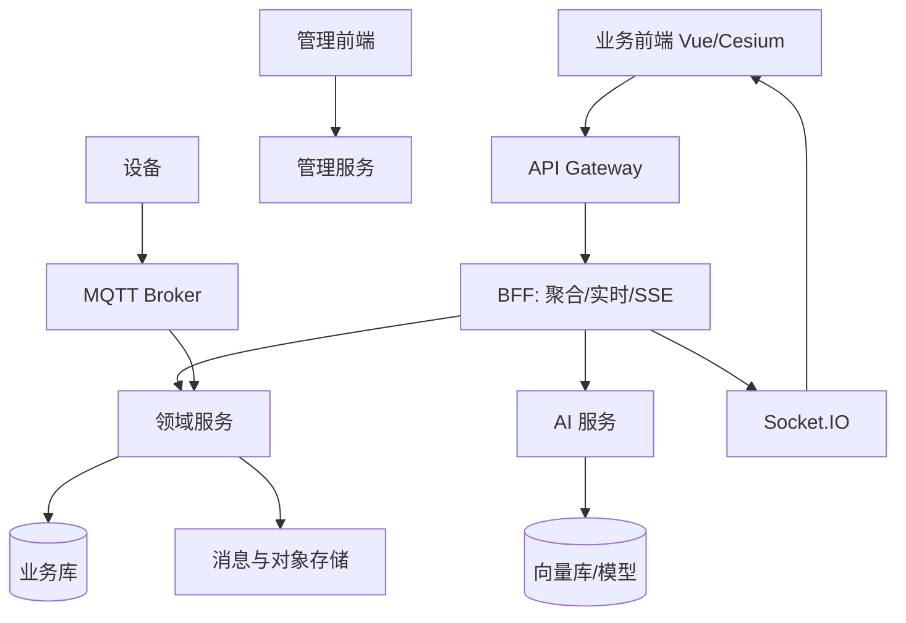
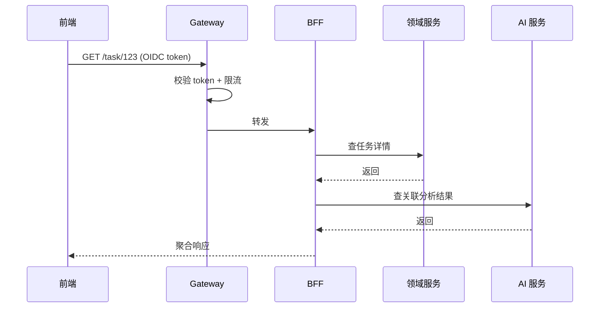
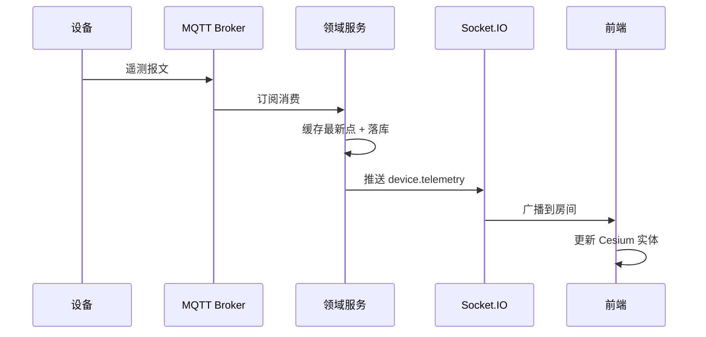
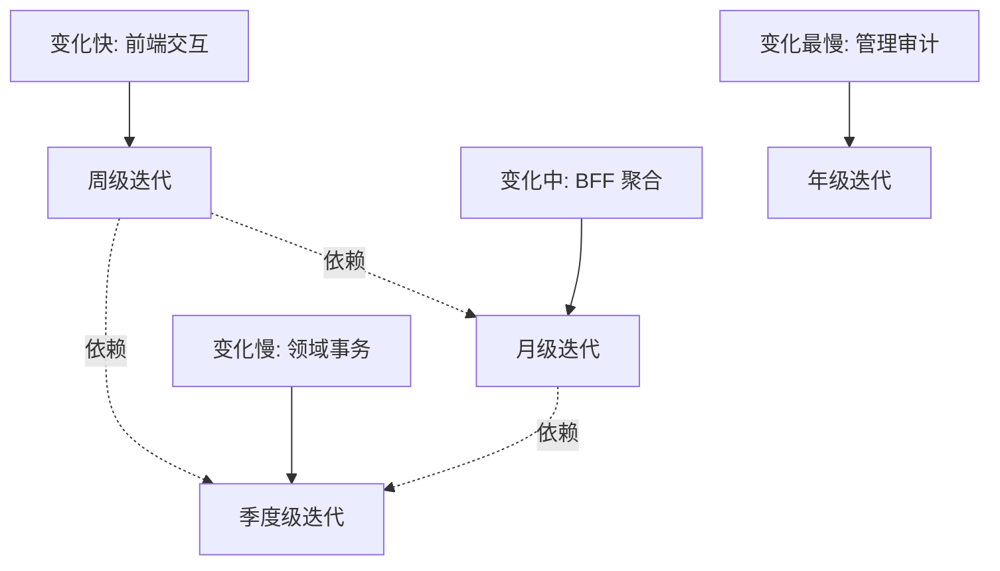
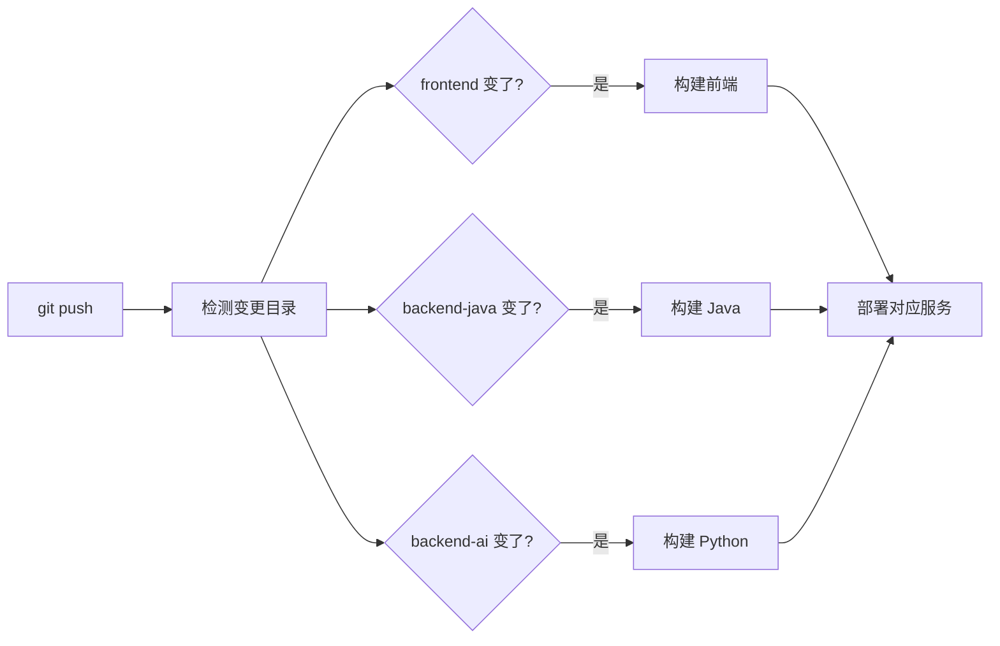

当系统同时有三维前端、实时推送、领域业务、AI 推理时，「一个后端打天下」会很快失控。用 **单体仓库 + 多服务边界** 是一种折中：代码在一起好协作，运行时仍按职责拆开。下文给一种可参考的分工，不绑定具体产品名。

## 一、为什么选 Monorepo

| | Monorepo | 多仓库 |
|---|---|---|
| 联调 | 一条命令起全栈 | 各仓库分别拉起 |
| 版本对齐 | 一起打 tag | 手动协调版本 |
| 契约 | OpenAPI 同目录可见 | 跨仓库找 schema |
| CI | 按目录增量构建 | 各自独立流水线 |
| 权限 | 统一管理 | 可按仓库隔离 |

选 Monorepo 的前提：团队不大、服务间契约频繁变更、需要快速联调。

## 二、分层示意



## 三、谁负责什么

| 服务 | 擅长 | 不该塞的东西 |
|---|---|---|
| 前端 | 三维交互、表单、推送消费 | 复杂权限判定真相源 |
| Gateway | 鉴权、路由、限流 | 业务规则 |
| BFF | 聚合接口、Socket、SSE 适配 | 长期核心账本 |
| 领域服务 | 任务/设备/告警事务一致性 | 模型推理细节 |
| AI 服务 | 推理、RAG、视觉 | 用户体系与计费主数据 |
| 管理服务 | 配置、审计、RBAC | 高频遥测通路 |

## 四、Monorepo 的目录与边界

```text
skytrace/
├── frontend/        # 业务前端
├── admin-frontend/  # 管理前端
├── gateway-java/    # API 网关
├── backend-node/    # BFF + 实时
├── backend-java/    # 领域服务
├── backend-ai/      # AI 推理
├── admin-service/   # 管理服务
├── device-sim/     # 设备模拟
├── e2e/            # 端到端测试
├── deploy/         # Compose 部署
└── docs/           # 架构文档
```

**纪律**：

- 包边界清晰（不要跨服务直接 import 对方内部模块）
- 契约用 OpenAPI / 事件 schema 说话
- CI 按目录增量构建，避免「改一行 Python 全量编前端」

## 五、请求链路时序



## 六、实时链路时序



## 七、变化速率分层



按变化速率切服务，是 Monorepo 不退化为「大泥球」的关键。

## 八、CI 增量构建



## 九、小结

「小平台」不是微服务崇拜，而是承认：**交互、事务、推理的变化速率不同**。仓库可以一体，进程必须按变化速率切开——这是后续扩展实时、AI、管理端时最省劲的底盘。
