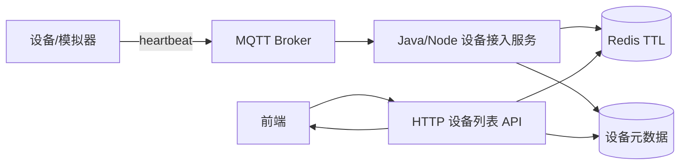
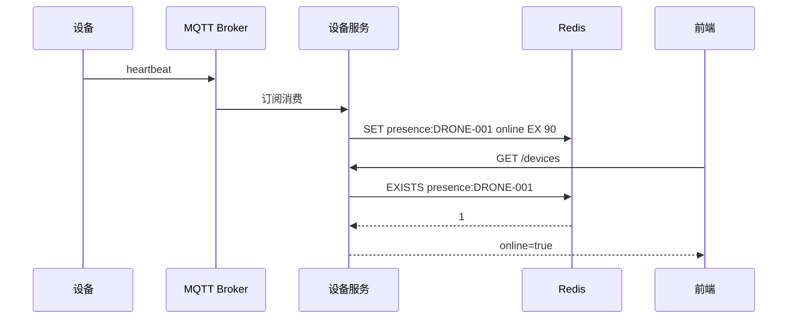
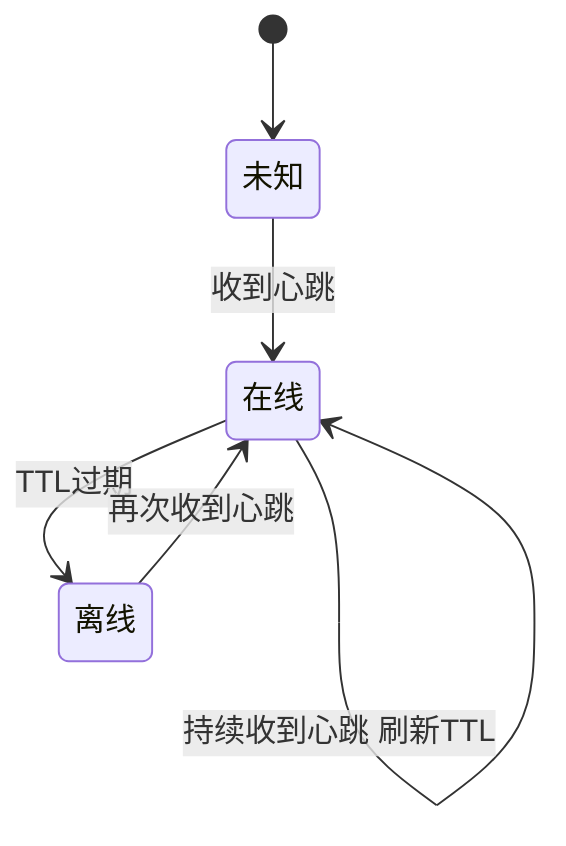
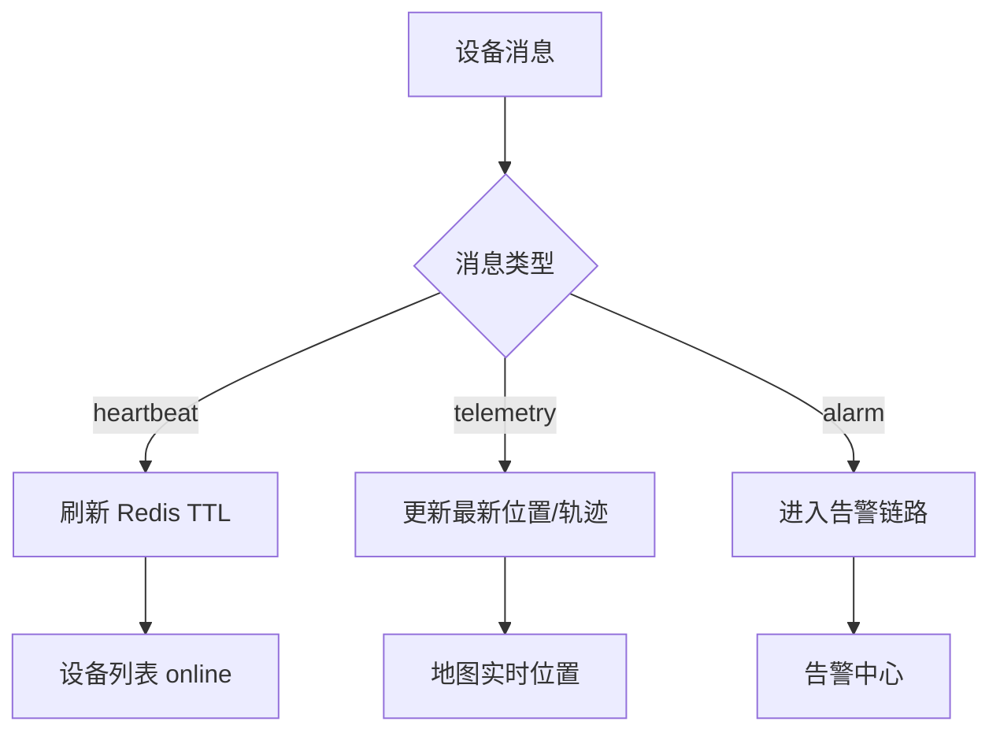

设备在线状态看起来很简单：设备连着就是在线，断了就是离线。但在无人机、机库、传感器这类设备平台里，如果让浏览器直接连 Broker 或依赖前端长连接判断在线，会带来安全和一致性问题。

更稳妥的方式是：**设备通过 MQTT 上报心跳，后端消费后写 Redis TTL，前端仍然通过普通 HTTP 列表查询设备在线状态**。

本文整理一套脱敏后的设备在线设计，不暴露真实 MQTT 账号、Topic 和设备编号。

## 一、为什么浏览器不直接连 Broker

浏览器直接连 MQTT Broker 看起来省事，但问题不少：

| 问题 | 说明 |
|---|---|
| 凭证暴露 | Broker 用户名/密码容易被抓到 |
| 权限粗 | 前端很难精细限制 Topic |
| 数据不一致 | 每个浏览器都判断在线，结果可能不同 |
| 难审计 | 谁订阅了什么 Topic 不好追踪 |

所以更推荐：设备接入归设备服务处理，浏览器只看业务 API。

## 二、整体架构



设备在线不需要浏览器维持一条设备长连接。前端只要定期请求设备列表，服务端把 Redis TTL 状态拼进去即可。

## 三、心跳 Topic 与 Payload

对外文章里不要贴真实 Topic，可以抽象成：

```text
devices/{deviceId}/heartbeat
```

Payload 示例：

```json
{
  "deviceId": "DRONE-001",
  "timestamp": 1720000000000,
  "battery": 82,
  "status": "idle"
}
```

后端消费后只做几件事：

1. 校验 deviceId 是否存在
2. 校验时间戳是否合理
3. 写 Redis 在线 key，设置 TTL
4. 可选：更新最新电量/状态缓存

## 四、Redis TTL 在线判定



假设设备每 30 秒发一次心跳，TTL 可以设成 90 秒：

```js
const ttlSeconds = 90;
await redis.set(`presence:${deviceId}`, 'online', 'EX', ttlSeconds);
```

如果设备断电或网络断开，不需要额外发送离线消息，TTL 到期自然离线。

## 五、状态流转



这套状态机的好处是：**离线是时间自然推导出来的**，不依赖设备主动发「我下线了」。

## 六、前端为什么仍用 HTTP

前端展示设备列表时可以继续用 HTTP：

```js
async function fetchDevices() {
  const list = await request('/api/devices');
  return list.map((item) => ({
    ...item,
    onlineText: item.online ? '在线' : '离线'
  }));
}
```

优点：

- 页面刷新不丢状态
- 列表分页、筛选、权限都走同一套 API
- 不需要把 MQTT 凭证暴露给浏览器
- 服务端可以统一做租户/项目权限过滤

如果需要更实时的 UI，可以前端每 10-30 秒轮询一次，或由 WebSocket 只推「状态变化事件」，但仍不让浏览器直连设备 Broker。

## 七、边界情况

| 场景 | 处理 |
|---|---|
| 心跳延迟 | TTL 不要设太短，至少 2-3 倍心跳间隔 |
| 设备时间不准 | 在线判定以服务端消费时间为准 |
| 多实例消费 | MQTT 接入服务要避免重复消费 |
| Redis 重启 | 在线状态可短暂未知，由下一次心跳恢复 |
| 设备主动下线 | 可立即 DEL presence key，但不能只依赖它 |

## 八、与实时遥测的关系

在线状态和遥测流不要混成一个概念：



心跳只回答「设备是否活着」；遥测回答「设备在哪里、状态如何」。两条链路可以共享 Broker，但业务含义不同。

## 九、小结

设备在线状态的关键不是让前端连上 MQTT，而是建立一个可靠的服务端事实源：

- 设备发心跳
- 后端消费并刷新 Redis TTL
- TTL 过期自然离线
- 前端通过 HTTP 查询聚合后的在线状态

这套设计简单、可观测、容易运维，也能避免把设备接入层的复杂度暴露给浏览器。
