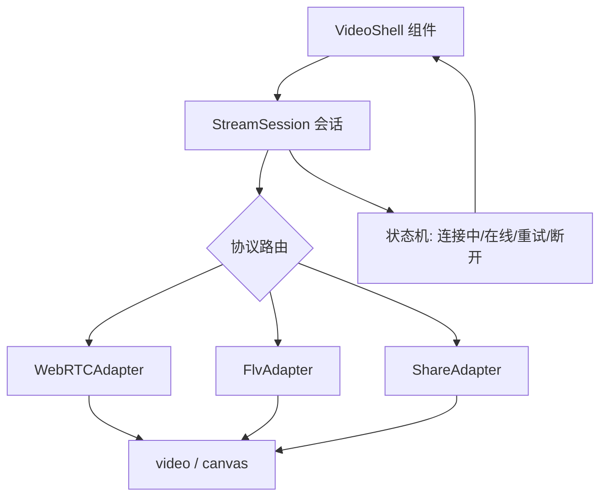
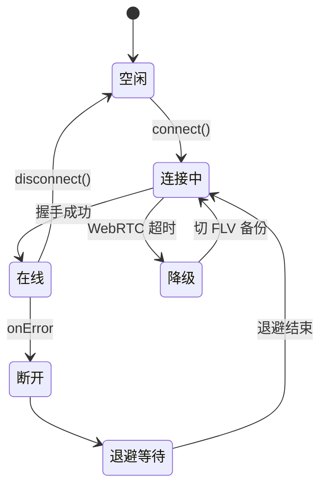
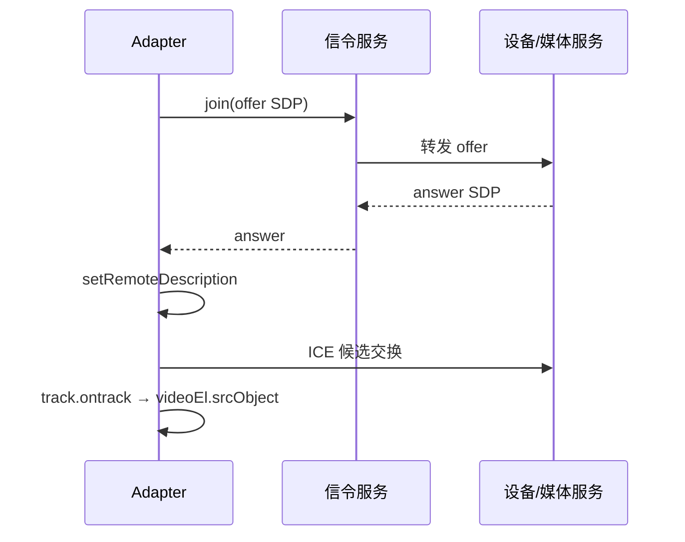
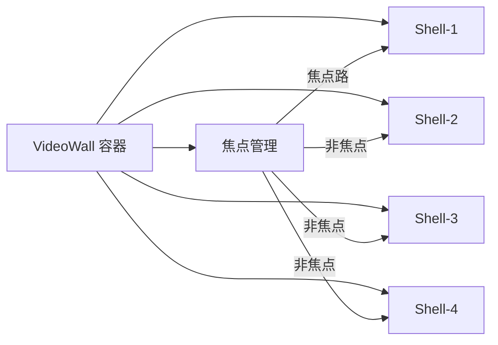

无人机/机库场景里，视频来源经常不统一：有的链路给 WebRTC，有的给 HTTP-FLV，还有分享页只要「能看就行」。前端如果按协议写三套页面，后面的多路视频墙会很难维护。更稳的做法是：**一个播放器壳 + 可插拔协议适配器**。

## 一、为什么不统一协议

理想是全链路 WebRTC，但现实里：

| 协议 | 延迟 | 兼容性 | 成本 |
|---|---|---|---|
| WebRTC | ~200ms | 需信令服务 | 高 |
| HTTP-FLV | 1-3s | 浏览器原生 | 低 |
| HLS | 5-10s | 移动端好 | 低 |

设备固件、网络环境、运维能力都不同，短期内很难收敛到一种。前端要做的不是消灭差异，而是 **让差异不影响 UI 层**。

## 二、设计目标

- UI 只关心：播放、暂停、静音、全屏、失败重试
- 协议细节关在 adapter 内
- 允许运行时切换（例如弱网从 WebRTC 降级到 FLV）
- 多路视频墙可复用同一壳

## 三、整体结构



## 四、统一会话接口

```ts
interface StreamAdapter {
  connect(opts: ConnectOptions): Promise<void>;
  disconnect(): Promise<void>;
  getStats?(): Promise<Record<string, number>>;
}

interface ConnectOptions {
  url: string;
  protocol: 'webrtc' | 'flv' | 'share';
  token?: string;
  videoEl: HTMLVideoElement;
  onError?: (e: Error) => void;
}
```

`StreamSession` 负责：

1. 根据 `protocol` 选 adapter
2. 统一超时与重试
3. 组件卸载时必调 `disconnect`（防媒体轨道泄漏）

## 五、连接状态机



## 六、WebRTC 适配器要点



注意：

- `RTCPeerConnection` 生命周期要跟组件绑定，卸载时 `close()`
- `ontrack` 拿到 stream 后赋给 `videoEl.srcObject`，不是 `src`
- ICE 失败要触发降级，不要无限重试同协议

## 七、FLV 适配器要点

```js
class FlvAdapter {
  async connect({ url, videoEl }) {
    if (!flvjs.isSupported()) throw new Error('FLV not supported');
    this.player = flvjs.createPlayer({
      type: 'flv',
      isLive: true,
      url
    });
    this.player.attachMediaElement(videoEl);
    await this.player.load();
    // 自动播放策略：先静音再 play
    videoEl.muted = true;
    await videoEl.play();
  }
  disconnect() {
    this.player?.destroy();
  }
}
```

FLV 的优势是兼容性好、无需信令；劣势是延迟比 WebRTC 高，且依赖 `MediaSource Extensions`（iOS Safari 不支持）。

## 八、切换策略

| 条件 | 动作 |
|---|---|
| WebRTC 连接超时 | 自动尝试 FLV 备份地址 |
| 分享页无登录态 | 走独立分享信令，不复用主站 Token |
| 多路墙超过 N 路 | 非焦点路降码率或暂停解码 |
| iOS Safari | 跳过 FLV，直接 HLS 或 WebRTC |

切换时先停旧 adapter，再启新 adapter，避免两路音频叠在一起。

## 九、多路视频墙的扩展



焦点路用高码率，非焦点路降码率或暂停解码——这是多路墙不崩的关键。

## 十、常见坑

1. **隐藏 tab 仍解码**：`visibilitychange` 时暂停非关键路
2. **FLV 自动播放策略**：先静音再 play，符合浏览器策略
3. **分享页安全**：短链 code + 服务端鉴权，前端不写死长期密钥
4. **媒体轨道泄漏**：组件卸载必调 `disconnect`，否则 `RTCPeerConnection` 不释放
5. **iOS Safari**：不支持 MSE/FLV，需提前降级到 HLS

## 十一、小结

协议会变，视频墙产品形态也会变；把「壳」和「适配器」拆开后，新增一种传输方式通常只是多一个 adapter，而不是复制一整页直播间。
