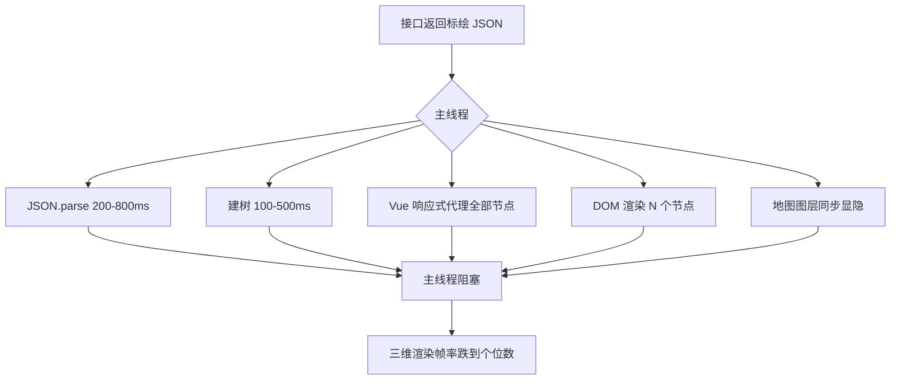
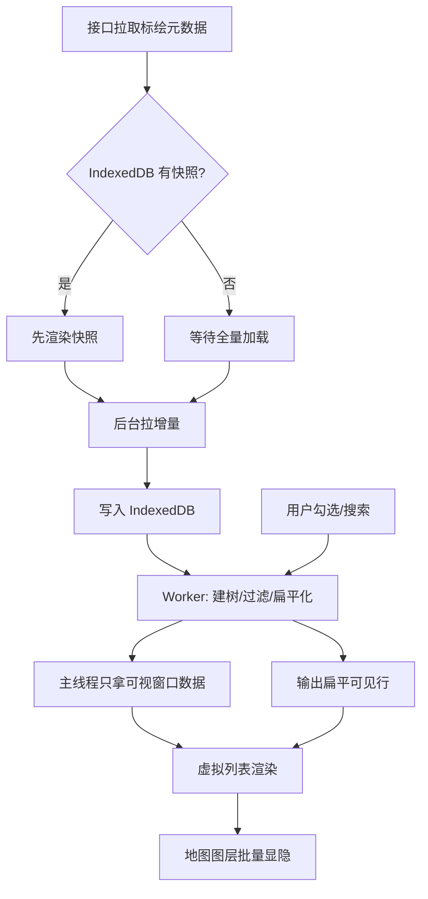
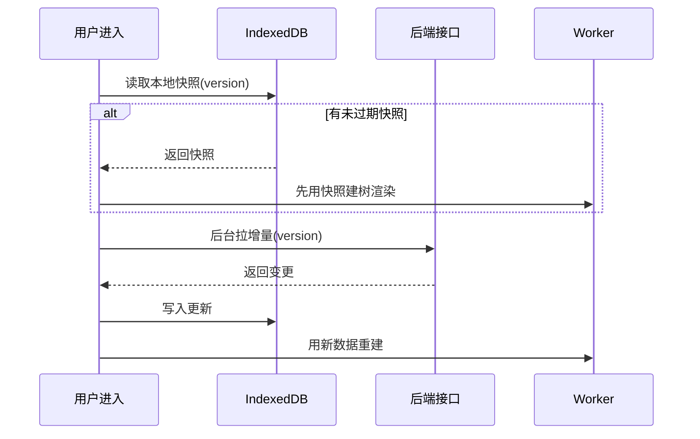
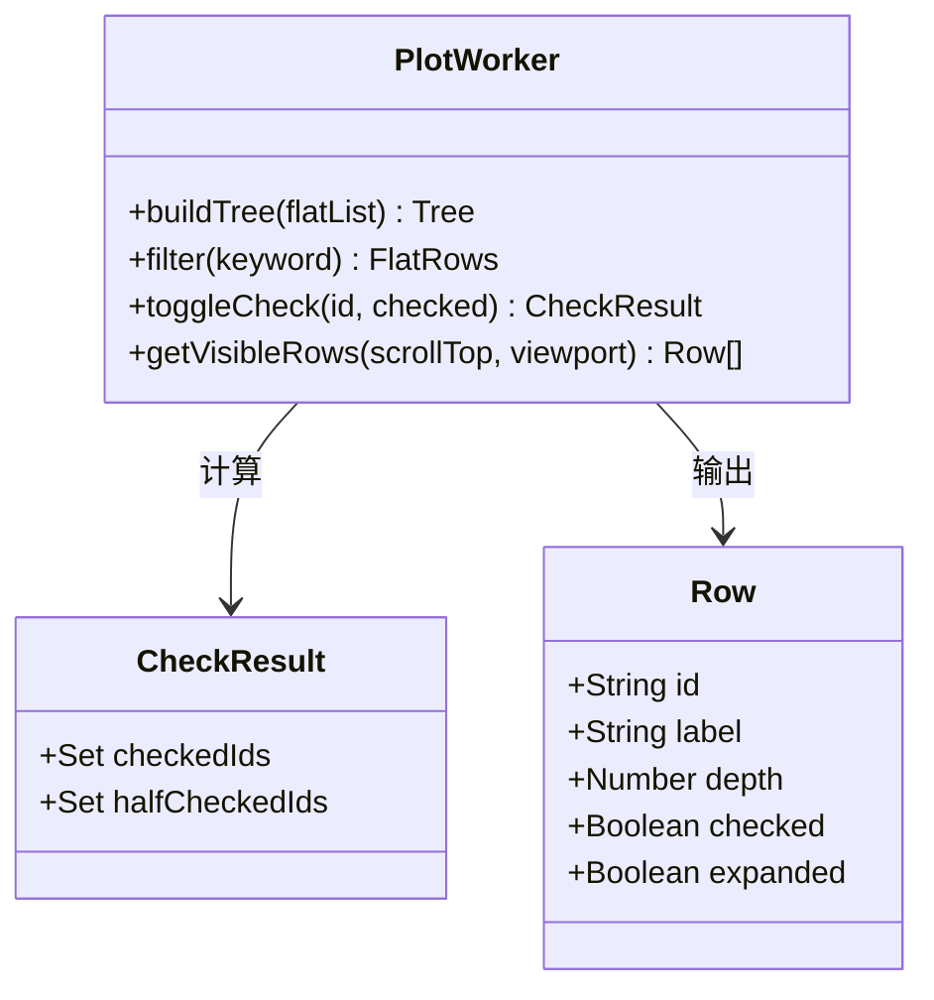
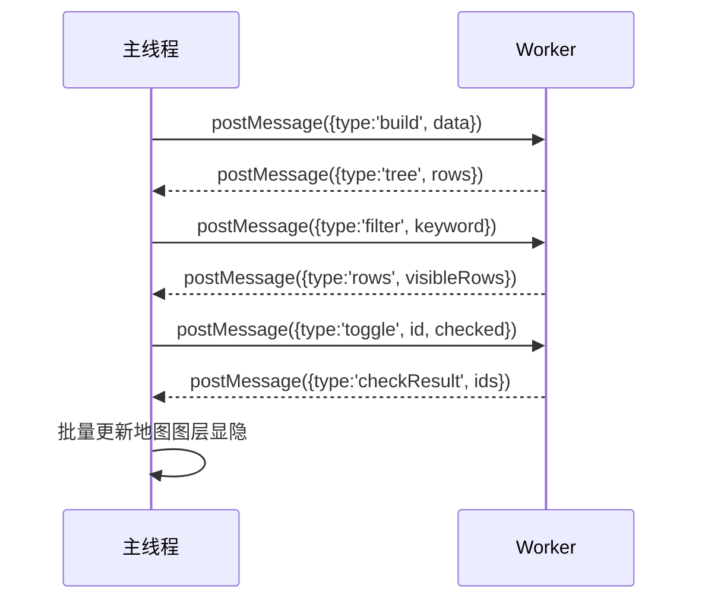

应急/巡检类三维台里，标绘图层动辄成百上千节点。一旦用普通树组件全量渲染，主线程很容易被「展开/筛选/勾选」拖死。本文总结一套可落地的三联方案：**Web Worker 算树 + IndexedDB 缓存 + 虚拟滚动展示**。

## 一、问题长什么样

用户打开标绘面板后的真实体验：

| 操作 | 期望 | 实际 |
|---|---|---|
| 打开面板 | < 500ms | 白屏 3-8 秒 |
| 输入筛选 | 即时过滤 | 每打一个字卡 200ms |
| 勾选父节点 | 子节点联动 | 页面假死 1-2 秒 |
| 滚动长列表 | 流畅 | 掉帧、白条闪烁 |

根因通常不是「树组件写得差」，而是 **JSON 解析、树构建、DOM 节点过多** 全挤在主线程，和三维地图渲染抢同一根时间线。

## 二、性能瓶颈定位



关键认知：**标绘数据和三维渲染在抢同一个主线程**。不把数据运算移走，三维一定让步。

## 三、方案总览



## 四、IndexedDB：秒开与持久

### 为什么不用 localStorage

| | localStorage | IndexedDB |
|---|---|---|
| 容量 | ~5MB | 几百MB+ |
| 阻塞主线程 | 是（同步） | 否（异步） |
| 存对象 | 需序列化 | 原生结构化克隆 |
| 索引查询 | 无 | 有 |

标绘数据动辄几 MB，localStorage 会让主线程在读写时冻住。

### 缓存策略时序



只缓存 **元数据与树结构**，几何坐标大字段按需再取，避免 IndexedDB 膨胀。

### 简易封装

```js
const DB_NAME = 'plot-cache';
const STORE = 'snapshots';

async function openDB() {
  return new Promise((resolve, reject) => {
    const req = indexedDB.open(DB_NAME, 1);
    req.onupgradeneeded = () => {
      req.result.createObjectStore(STORE, { keyPath: 'layerId' });
    };
    req.onsuccess = () => resolve(req.result);
    req.onerror = () => reject(req.error);
  });
}

async function getSnapshot(db, layerId) {
  return new Promise((resolve) => {
    const tx = db.transaction(STORE, 'readonly');
    const req = tx.objectStore(STORE).get(layerId);
    req.onsuccess = () => resolve(req.result);
    req.onerror = () => resolve(null);
  });
}
```

## 五、Worker：建树与过滤离主线程

### Worker 职责



把这些工作丢进 Worker：

- `list → tree` 构建
- 关键字过滤（保留祖先路径）
- 勾选联动计算（半选/全选）
- 输出「扁平可见行」给虚拟列表

主线程只做：接收行数据、更新勾选 UI、把勾选结果映射回地图图层显隐。

### 过滤逻辑要点

```js
// Worker 内：过滤时保留祖先路径，否则树断裂
function filterTree(root, keyword) {
  const result = [];
  function walk(node, ancestorsMatched) {
    const selfMatch = node.label.includes(keyword);
    if (selfMatch || ancestorsMatched) {
      result.push(node);
      for (const child of node.children || []) {
        walk(child, true); // 祖先已匹配，子节点全保留
      }
    } else {
      for (const child of node.children || []) {
        walk(child, false);
      }
    }
  }
  walk(root, false);
  return result;
}
```

### 主线程与 Worker 通信



## 六、虚拟滚动：只挂载可视区

无论 `el-tree` 魔改还是自研树，核心指标是：

- DOM 节点数 ≈ 视口行数 × 常数
- 滚动只改 `transform` / 窗口切片，不整树重挂


勾选状态建议用 `Map<id, checked>` 存在主线程或 Worker，**不要**给每个节点挂沉重 Vue 响应式对象。

### 简易虚拟列表思路

```js
function getVisibleRange(rows, scrollTop, rowHeight, viewportHeight) {
  const start = Math.max(0, Math.floor(scrollTop / rowHeight) - buffer);
  const end = Math.min(
    rows.length,
    Math.ceil((scrollTop + viewportHeight) / rowHeight) + buffer
  );
  return { start, end, offsetY: start * rowHeight };
}
```

## 七、地图侧批量显隐

勾选结果映射到地图时，**不要逐个 `entity.show = true/false`**，那会触发 N 次 `requestRender`：

```js
// 批量提交，一次刷新
function applyVisibility(entities, visibleIds) {
  const set = new Set(visibleIds);
  const toUpdate = [];
  for (const entity of entities) {
    const target = set.has(entity.id);
    if (entity.show !== target) {
      entity.show = target;
      toUpdate.push(entity);
    }
  }
  // 一次 requestRender
  viewer.scene.requestRender();
}
```

## 八、落地检查清单

- [ ] 首屏是否「缓存优先」
- [ ] 过滤是否在 Worker 完成
- [ ] 勾选 1000+ 节点是否仍可交互
- [ ] 地图图层显隐是否批量提交
- [ ] 切换任务时实体是否清干净

## 九、小结

三联方案的分工：

- **IndexedDB** 负责持久与秒开
- **Worker** 负责 CPU 密集的树运算
- **虚拟滚动** 负责 DOM 上限

地图侧再配合「批量显隐 / 分层 Primitive」，标绘面板就不会再轻易卡死主屏三维交互。
