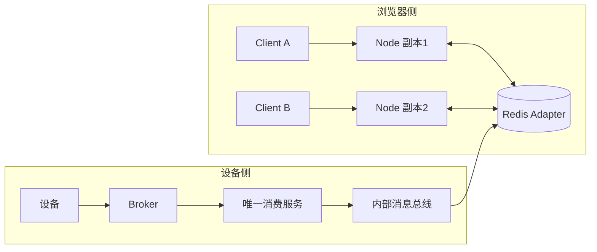
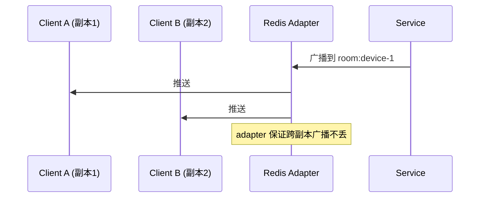
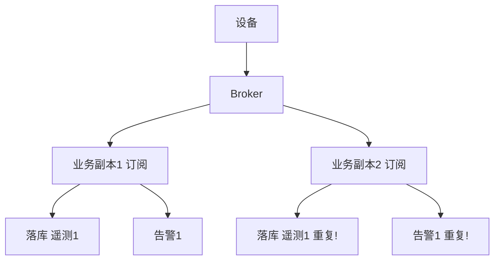
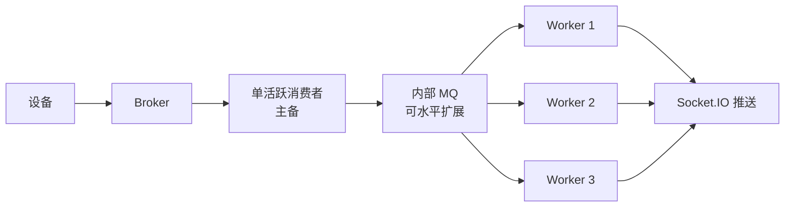
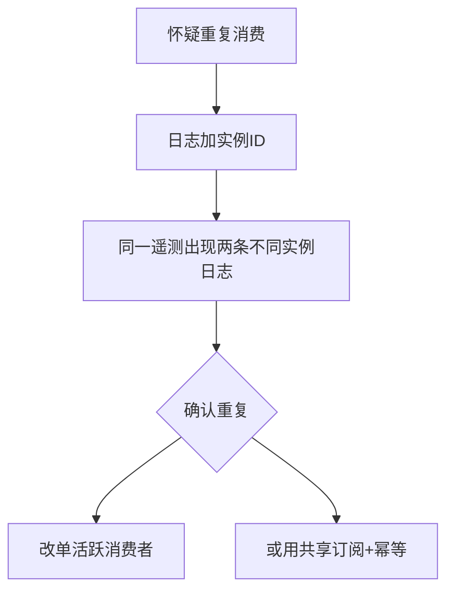

实时系统一忙就「多开几个副本」。但 Web 推送和设备接入不是同一种扩展模型： **Socket.IO 可以靠适配器水平扩展，MQTT 订阅端却常常必须是单活跃消费者**。分不清边界，轻则消息重复，重则状态错乱。

## 一、两种连接的本质区别

| | Socket.IO | MQTT |
|---|---|---|
| 面向 | 浏览器 | 设备 |
| 连接数 | 可分散到多副本 | Broker 统一接入 |
| 广播 | 靠 adapter 同步 | 靠 broker 订阅 |
| 多副本风险 | 低（adapter 处理） | 高（重复消费） |

## 二、拓扑对比



## 三、Socket.IO：多副本 OK 的前提



使用 Redis Adapter 后：

- 浏览器连接数可以随 Node 副本近似线性扩
- 会话粘性可选，但广播依赖适配器而不是「碰巧打到同一进程」
- 鉴权在握手完成；重连要能恢复房间订阅

## 四、MQTT：为什么要慎扩



若多个业务副本用**相同 clientId/相同共享语义不当**去订同一设备主题：

- 可能互踢（同 clientId 只保留一个连接）
- 或每条遥测被处理多次
- 落库/推送出现双份轨迹、双份告警

## 五、稳妥的 MQTT 扩展模式



常见稳妥模式：

1. **单活跃消费者**（主备）把 MQTT → 内部 MQ
2. 或 Broker 共享订阅（需集群支持且业务幂等）
3. 再由可水平扩展的 Web 层对外推送

## 六、扩展矩阵

| 组件 | 多副本 | 备注 |
|---|---|---|
| WebSocket/Socket.IO 接入 | 可以 | 需 adapter |
| MQTT 接入业务进程 | 默认不行 | 先汇聚再扇出 |
| 无状态 HTTP API | 可以 | 注意限流键 |
| 本地内存会话 | 不行 | 外置 Redis |
| SSE 连接 | 可以 | 注意 sticky + 超时 |

## 七、Redis Adapter 配置示意

```ts
import { Server } from 'socket.io';
import { createAdapter } from '@socket.io/redis-adapter';
import { createClient } from 'redis';

const pubClient = createClient({ url: 'redis://...' });
const subClient = pubClient.duplicate();
await Promise.all([pubClient.connect(), subClient.connect()]);

const io = new Server(httpServer, {
  cors: { origin: '*' }
});

io.adapter(createAdapter(pubClient, subClient));
```

## 八、排障：重复消费怎么确认



## 九、小结

扩展不是「所有有连接的进程都加机器」。先画清：**谁面向浏览器，谁面向设备，消息在哪一层扇出**。Socket.IO 扩的是接入；MQTT 往往扩的是「汇聚之后」的那一段。
