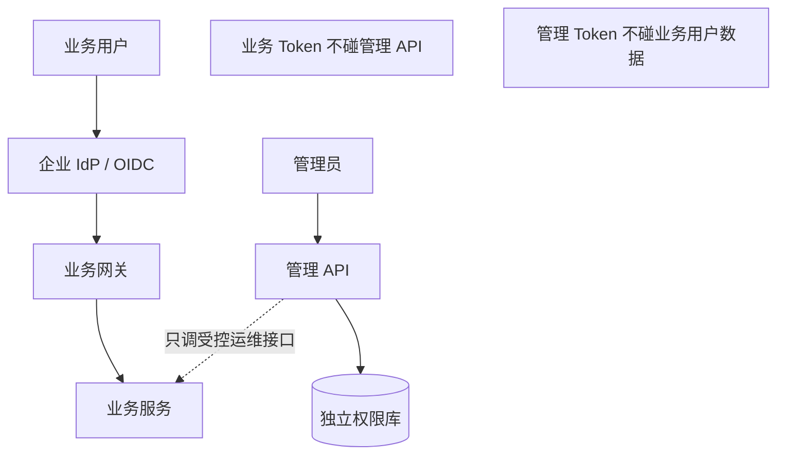
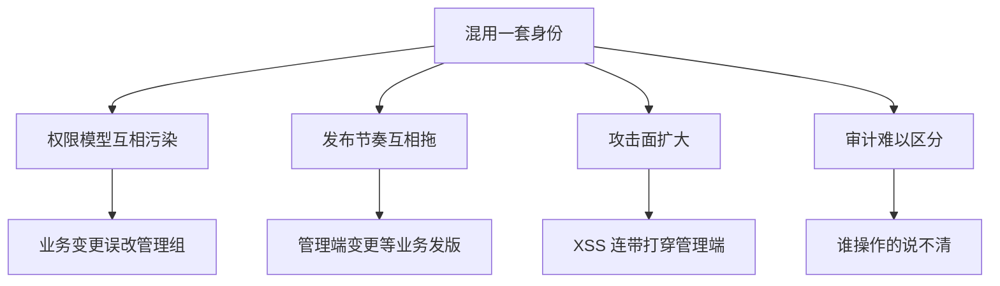
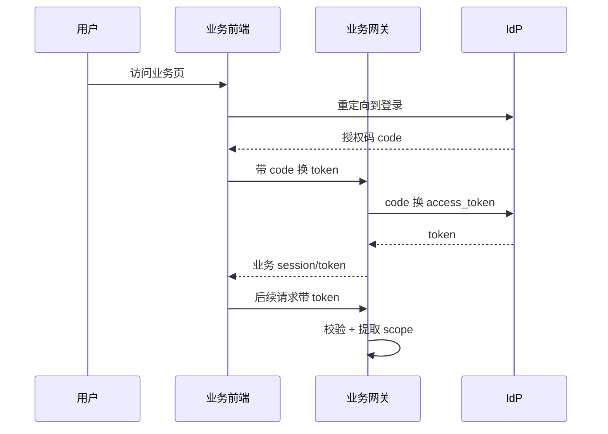
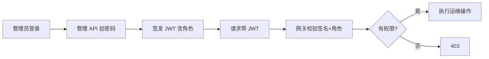
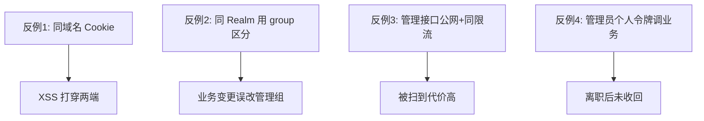
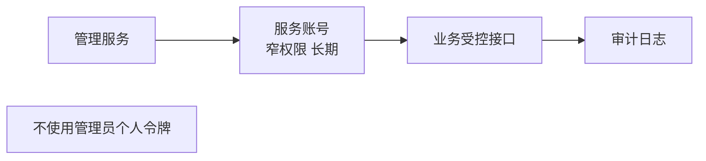

不少平台会同时存在「业务用户」和「系统管理员」。把两套人马塞进同一个登录域，看起来省事，实际会在权限模型、审计与发布节奏上互相拖累。更稳妥的做法是：**业务走企业级 OIDC，管理端走独立身份与 RBAC**。

## 一、两种用户，两种风险面

| | 业务端 | 管理端 |
|---|---|---|
| 用户 | 作业人员/客户账号 | 内部运维/配置员 |
| 协议 | OIDC / 统一认证 | 自建登录 + JWT |
| 权限 | 租户/项目/设备范围 | 菜单与危险操作 RBAC |
| 发布 | 与业务迭代强相关 | 变更更少、审计更严 |
| 被攻击代价 | 影响单用户 | 影响全平台 |

## 二、推荐拓扑

## 三、为什么要拆

## 四、业务端：OIDC 流程

## 五、管理端：独立 JWT + RBAC

要点：

- 管理端 **不要** 直接复用业务 Refresh Token 调所有业务 API
- 业务网关校验 OIDC Access Token；管理 API 校验自己的 JWT
- 跨系统调用用窄权限服务账号，而不是「管理员个人令牌」

## 六、常见反例

1. 前端把管理 Token 存同一域名 Cookie，业务站被 XSS 连带打穿管理端
2. 同一 Realm 里用 group 区分管理员，业务变更误改管理组
3. 管理接口暴露在公网且与业务同限流策略，被扫到代价更高
4. 用管理员个人令牌做系统间调用，离职后未收回

## 七、跨系统调用的正确姿势

- 服务账号有独立密钥，可轮换
- 只授予「需要的几个运维接口」
- 每次调用写审计日志

## 八、小结

拆开身份不是重复建设，而是 **缩小爆炸半径**。业务侧拥抱组织账号体系，管理侧强调可控 RBAC 与审计；两者通过显式、窄权限的集成点交互，平台才比较扛得住误操作与攻击面扩张。
