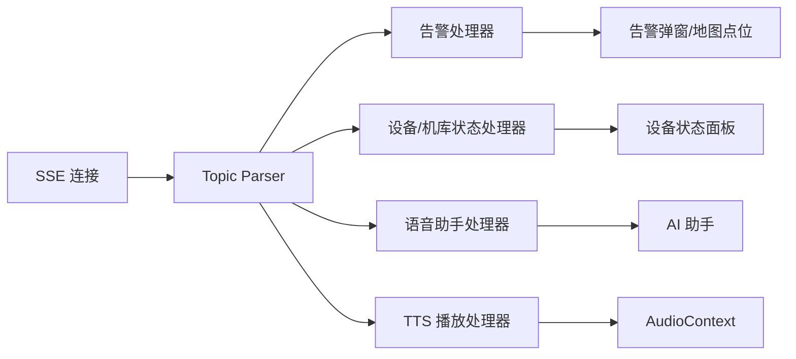
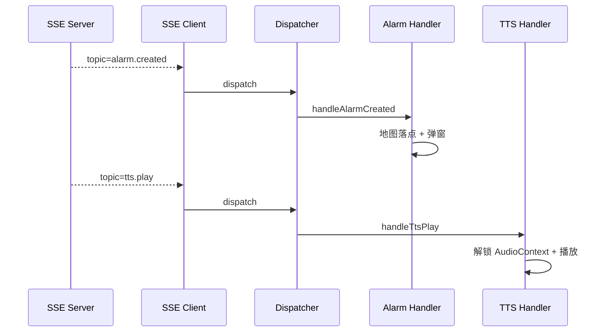
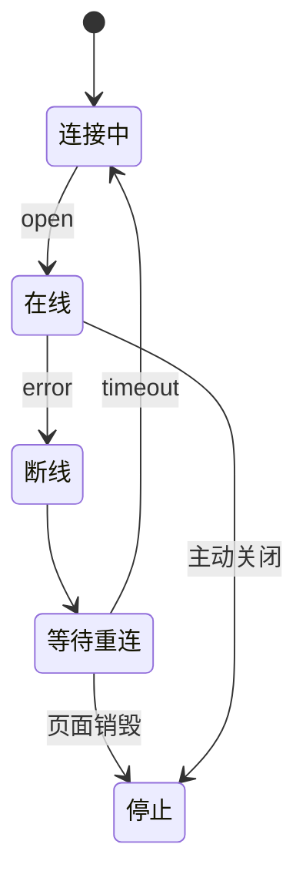
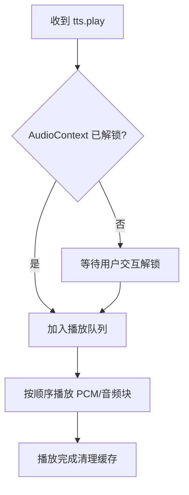

很多文章讲 SSE，只讲「服务端怎么不缓冲」。但在复杂操控台里，SSE 到前端之后还有另一层问题：**一条连接里可能同时推告警、设备状态、语音助手、TTS 播放等多类事件，前端如何分流？**

本文从前端事件总线角度，整理一套多 Topic SSE 的设计方式。示例均已脱敏，不包含真实接口、设备编号和告警内容。

## 一、为什么要多 Topic

如果每类事件都开一条连接，会有几个问题：

- 浏览器连接数变多
- 鉴权和重连逻辑重复
- 页面切换时清理复杂
- 服务端推送通道难以统一治理

因此很多系统会选择：**一条 SSE 连接，多类 topic 分发**。

## 二、总体结构



SSE 层只负责连接和解析，不要直接操作所有 UI，否则会变成上帝模块。

## 三、事件格式设计

推荐统一 envelope：

```json
{
  "topic": "alarm.created",
  "id": "evt-001",
  "ts": 1720000000000,
  "payload": {}
}
```

这样分发层只看 `topic`，业务处理器再看 `payload`。

## 四、连接层

```js
function createSseClient(url, handlers) {
  const source = new EventSource(url);

  source.onmessage = (event) => {
    const msg = JSON.parse(event.data);
    dispatchTopic(msg, handlers);
  };

  source.onerror = () => {
    source.close();
    scheduleReconnect();
  };

  return source;
}
```

如果需要带自定义 Header，可以改成 `fetch + ReadableStream`，但连接层和分发层仍然保持一样的接口。

## 五、Topic 分发表

```js
const handlers = {
  'alarm.created': handleAlarmCreated,
  'device.status': handleDeviceStatus,
  'assistant.message': handleAssistantMessage,
  'tts.play': handleTtsPlay
};

function dispatchTopic(msg, handlers) {
  const handler = handlers[msg.topic];
  if (!handler) {
    console.warn('[sse] unknown topic', msg.topic);
    return;
  }
  handler(msg.payload, msg);
}
```

未知 topic 不应该让连接崩掉，只记录日志即可。

## 六、Topic 分流时序



## 七、不同 Topic 的处理边界

| Topic 类型 | 处理方式 |
|---|---|
| 告警 | 写入状态、地图落点、弹窗提示 |
| 设备状态 | 更新设备 Map，不弹窗 |
| AI 助手 | 写入对话流，支持打字机 |
| TTS | 进入音频队列，不走普通 UI 状态 |

如果所有 topic 都写进同一个 Vuex/Pinia 模块，会很快失控。更稳的做法是按领域拆处理器。

## 八、重连状态机



重连时建议带上 `lastEventId` 或业务游标，防止告警漏掉。

## 九、音频类 Topic 的特殊处理

TTS 和普通文本不同，容易撞到浏览器自动播放限制。推荐流程：



音频播放不要直接在 SSE 回调里堆 `new Audio()`，否则多段语音会互相抢。

## 十、小结

多 Topic SSE 的重点不是「能收到消息」，而是：**连接层、分发层、业务处理层分开**。

- 连接层：负责打开、关闭、重连
- 分发层：负责 topic 到 handler
- 处理层：负责各自业务副作用

这样即使后续新增告警、TTS、AI 助手或设备状态，也不会把 SSE 客户端写成一团。
