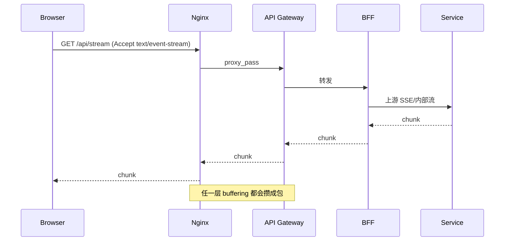
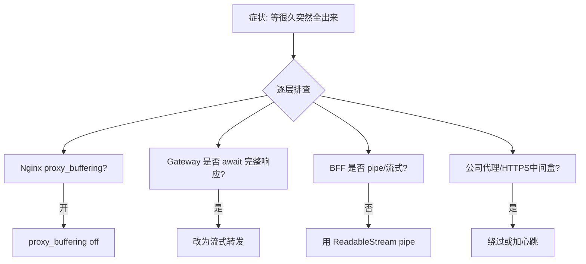
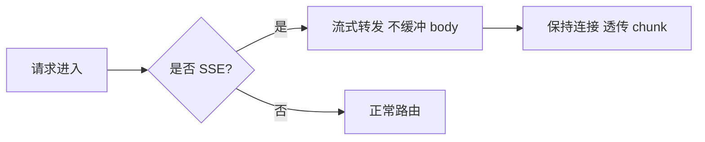
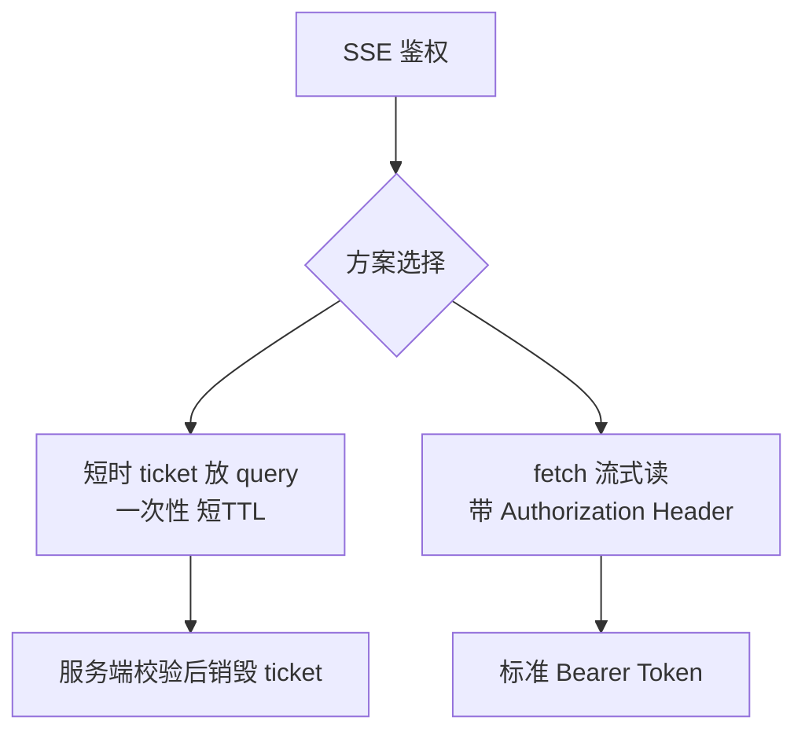
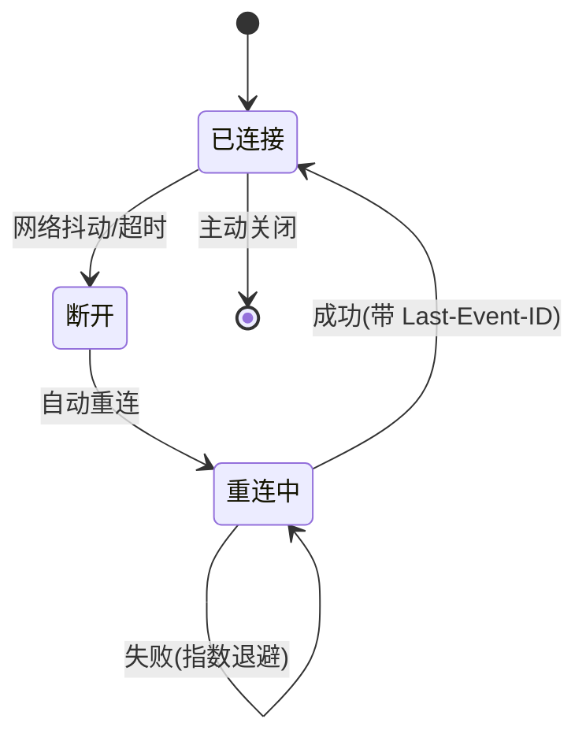

AI 对话、告警推送、长任务进度……这些场景常用 SSE。链路一旦变成「浏览器 → Nginx → Gateway → BFF → 业务服务」，任何一层默认缓冲都会让「流式」变成「最后一次性吐出」。本文总结如何把 SSE **真的流起来**。

## 一、SSE 的基本帧格式

SSE 是单向长连接，服务端按帧推送：

```text
event: token
data: {"text":"你"}

event: token
data: {"text":"好"}

event: done
data: [DONE]
```

每帧之间空行分隔。浏览器端 `EventSource` 或 `fetch + ReadableStream` 都能逐帧解析。

## 二、典型链路



## 三、缓冲问题定位



## 四、各层配置要点

### Nginx

```nginx
location /api/stream {
  proxy_buffering off;
  proxy_cache off;
  proxy_http_version 1.1;
  proxy_set_header Connection "";
  chunked_transfer_encoding on;
  proxy_read_timeout 300s;  # 大于心跳间隔
}
```

### Gateway（Spring Cloud Gateway 示意）



关键：不要把上游 `body` 读成完整 `String` 再转发，要用响应式/流式 API 透传。

### BFF（NestJS 示意）

```ts
@Sse('/stream')
async stream(): Promise<Observable<MessageEvent>> {
  return this.aiService.analyze().pipe(
    map(chunk => ({ event: 'token', data: chunk }))
  );
}
```

不要 `await` 上游成完整字符串再 `res.send`，用 pipe / streaming response。

### 浏览器

```js
// fetch 流式读，便于带 Authorization
const res = await fetch('/api/stream', {
  headers: { Authorization: `Bearer ${token}` }
});
const reader = res.body.getReader();
const decoder = new TextDecoder();

while (true) {
  const { done, value } = await reader.read();
  if (done) break;
  const text = decoder.decode(value);
  // 逐帧解析
  for (const line of text.split('\n\n')) {
    handleFrame(line);
  }
}
```

## 五、心跳保活

长时间无数据的连接会被中间设备断掉。服务端定时发注释行（不触发事件）：

```text
: keep-alive

: keep-alive
```

浏览器 `EventSource` 会忽略注释行，但连接保持活跃。间隔建议 15-30 秒。

## 六、鉴权怎么带



不要把长期 Refresh Token 塞进 URL——日志、浏览器历史都会留痕。

## 七、断线重连



- `EventSource` 原生支持 `Last-Event-ID`，服务端可据此续传
- `fetch` 方案需自己维护游标，断线后带上 `cursor` 参数

## 八、排障口诀

| 症状 | 优先怀疑 |
|---|---|
| 等很久突然全出来 | 某层 buffering |
| 一分钟断 | 空闲超时 / 无心跳 |
| 只自己环境不行 | 公司代理或 HTTPS 中间盒 |
| 多实例偶发丢 | Sticky / 连接打到不同副本 |
| 前几帧正常后面断 | 响应被提前 close |

## 九、小结

SSE「卡顿」多半不是业务模型慢，而是 **代理把流攒成了包**。从最外层 Nginx 往内逐层确认「不缓冲、可心跳、超时匹配」，通常就能恢复逐 token/逐事件的体验。
