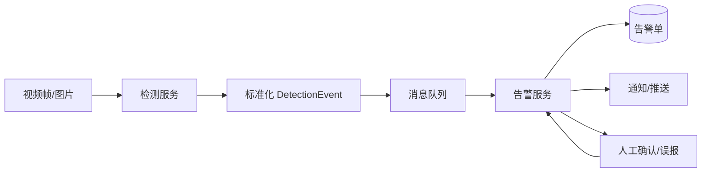
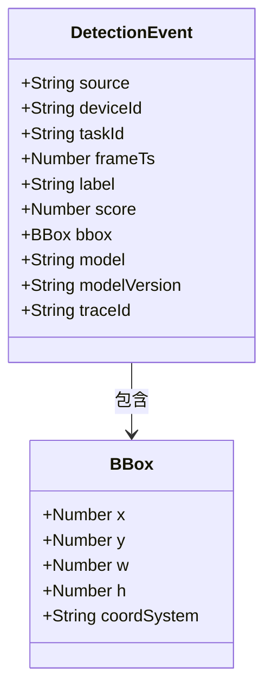
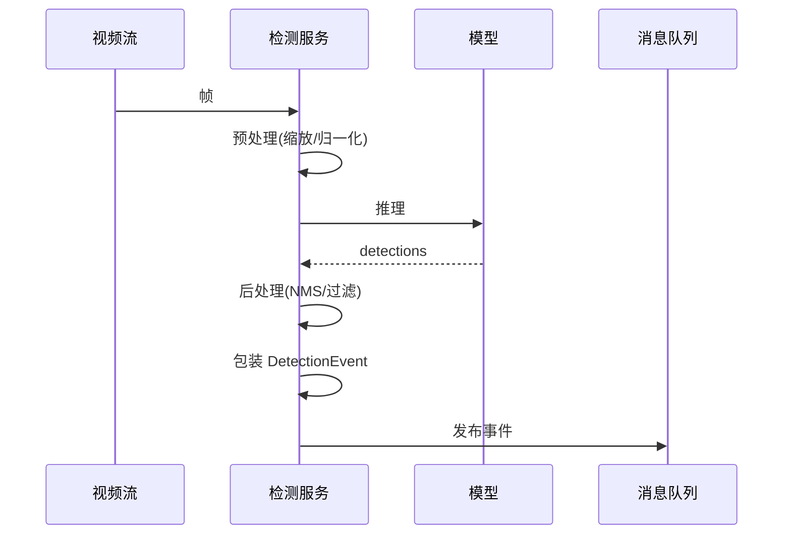
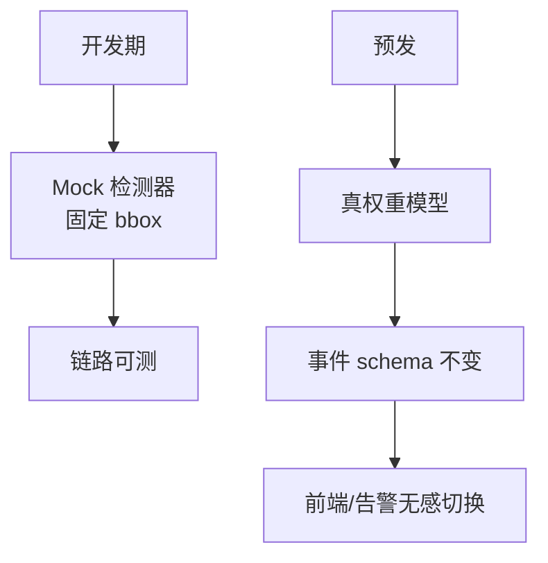
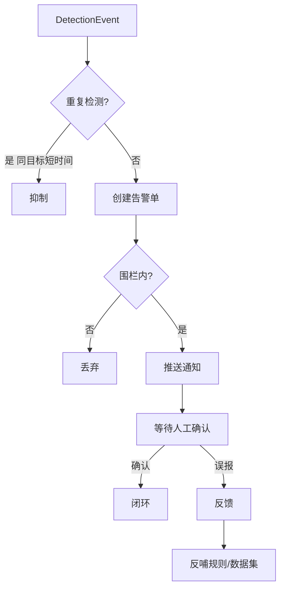
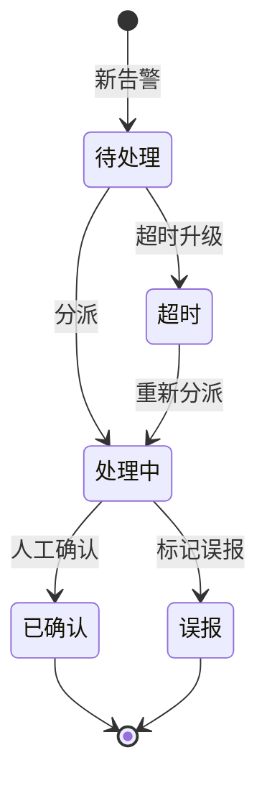

巡检场景里，模型打出「框和标签」只是起点；业务要的是 **可分派、可抑制、可追溯的告警**。把视觉服务直接耦合进业务库表，不如变成「检测事件 → 消息总线 → 告警服务」的闭环。

## 一、从检测结果到告警的鸿沟

| 模型输出 | 业务需要 |
|---|---|
| 框坐标 + 标签 + 置信度 | 谁的设备、什么时间、在哪、要不要处理 |
| 每帧都出 | 同一目标不要刷屏 |
| 无状态 | 要工单、要确认、要误报反馈 |

模型不懂「工单」，业务不该懂「bbox」。中间需要一层 **事件化**。

## 二、闭环图

## 三、DetectionEvent 最小字段

- `source`：设备/任务/帧时间
- `label` / `score`
- `bbox`（坐标系约定写清）
- `model` / `version`
- `traceId`

业务侧负责：阈值、地理围栏、重复告警合并、升级策略——不要让模型服务理解「工单」。

## 四、检测服务内部流程

## 五、Mock 与真权重

开发期用 mock 检测器保持链路可测；预发再挂真权重。**事件 schema 保持不变**，避免前端与告警服务被模型细节绑死。

## 六、告警服务内部处理

## 七、抑制与确认策略

| 策略 | 作用 |
|---|---|
| 时间窗去重 | 同一目标短时间不刷屏 |
| 置信度门槛可配 | 不同场景不同阈值 |
| 人工误报反馈 | 反哺规则或微调数据集 |
| 围栏过滤 | 围栏外丢弃，减少噪声 |

## 八、告警状态机

## 九、小结

视觉项目能上线，靠的往往不是更高的 mAP 宣传，而是 **检测结果是否事件化、告警是否可运营**。消息队列是模型世界和业务世界之间最清晰的防腐层。
