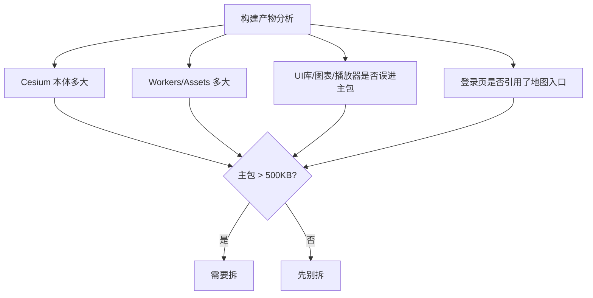
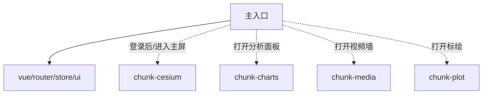
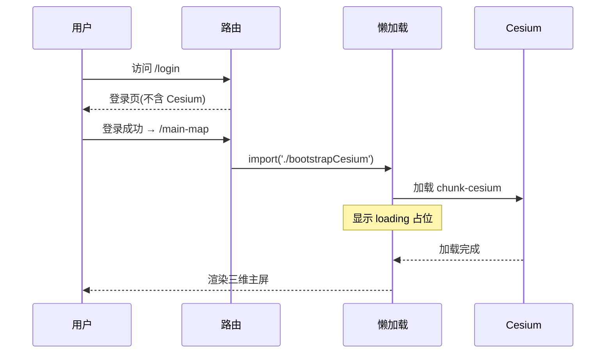
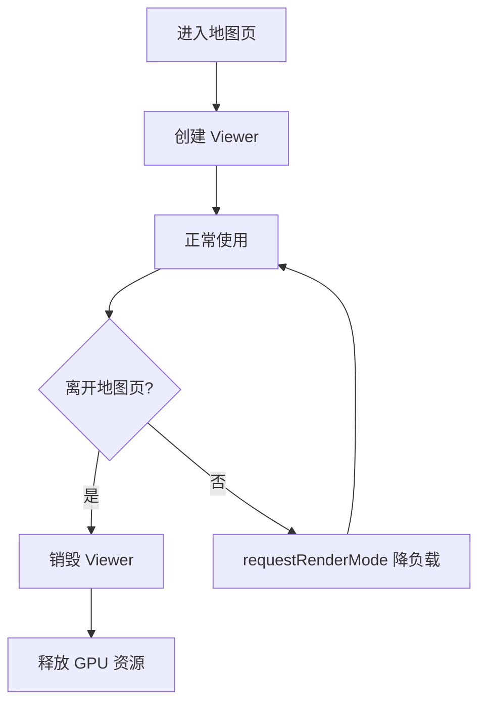

三维 GIS 控制台体积往往被 Cesium、图表、媒体 SDK 一起抬上去。若首屏登录后就把整包 Cesium 打进主 chunk，弱网用户会先看到长时间白屏。本文记录一种务实做法：**构建拆包 + 路由/交互触发的动态 import**。

## 一、拆之前先量

没有数据就拆包，很容易拆完更慢（多出额外往返）。先用构建分析看清：



## 二、推荐拆分策略



### Webpack splitChunks 示例

```js
// vue.config.js
module.exports = {
  configureWebpack: {
    optimization: {
      splitChunks: {
        chunks: 'all',
        cacheGroups: {
          cesium: {
            test: /[\\/]node_modules[\\/]cesium/,
            name: 'chunk-cesium',
            chunks: 'all',
            priority: 30,
            reuseExistingChunk: true
          },
          media: {
            test: /[\\/]node_modules[\\/](flv\.js|liveqing)/,
            name: 'chunk-media',
            priority: 20
          }
        }
      }
    }
  }
};
```

## 三、代码层面的「延后引用」

### 反例

```js
// main.js 顶层 —— 登录页也会加载 Cesium
import * as Cesium from 'cesium';
```

### 正例

```js
// 进入三维容器后再加载
async function ensureCesium() {
  if (window.__cesiumReady) return;
  await import(/* webpackChunkName: "chunk-cesium" */ './bootstrapCesium');
  window.__cesiumReady = true;
}
```

登录页、公告页、纯 H5 分享页都不应触发这条路径。

## 四、加载时序



## 五、CESIUM_BASE_URL 与静态资源

Cesium 依赖大量 Workers、Assets、Widgets 静态文件，路径必须对齐：

```js
// bootstrapCesium.js
import * as Cesium from 'cesium';
window.CESIUM_BASE_URL = '/cesium/';
// 确保 public/cesium/ 下有 Workers/Assets/Widgets
```

如果走 CDN，把 `CESIUM_BASE_URL` 指向 CDN 前缀，避免 chunk hash 导致旧页面引用 404。

## 六、内存与多页注意



- Hash 路由单页里「离开地图」建议销毁 Viewer，或至少 `requestRenderMode: true` 降负载
- 开发环境 pnpm symlink + 大依赖，注意文件系统缓存与 heap 上限（大型项目常见需要提高 Node 内存）

## 七、生产压缩加速 CI

```js
// 用 esbuild 压缩，比 terser 快数倍
const TerserPlugin = require('terser-webpack-plugin');
module.exports = {
  configureWebpack: {
    optimization: {
      minimizer: [
        new TerserPlugin({
          minify: TerserPlugin.esbuildMinify,
          terserOptions: { drop: ['console'] }
        })
      ]
    }
  }
};
```

## 八、效果检查清单

- [ ] 登录页不包含 Cesium（看 chunk 列表）
- [ ] 首屏 JS < 500KB
- [ ] 进入主屏后 Cesium chunk 异步加载
- [ ] Workers/Assets 路径不 404
- [ ] 离开地图页 GPU 内存回落

## 九、小结

把 Cesium「拆出去」不是为了消灭体积，而是为了 **让首屏不再为三维买单**。先量体积，再按用户路径懒加载，GIS 控制台的体感会立刻好转。
