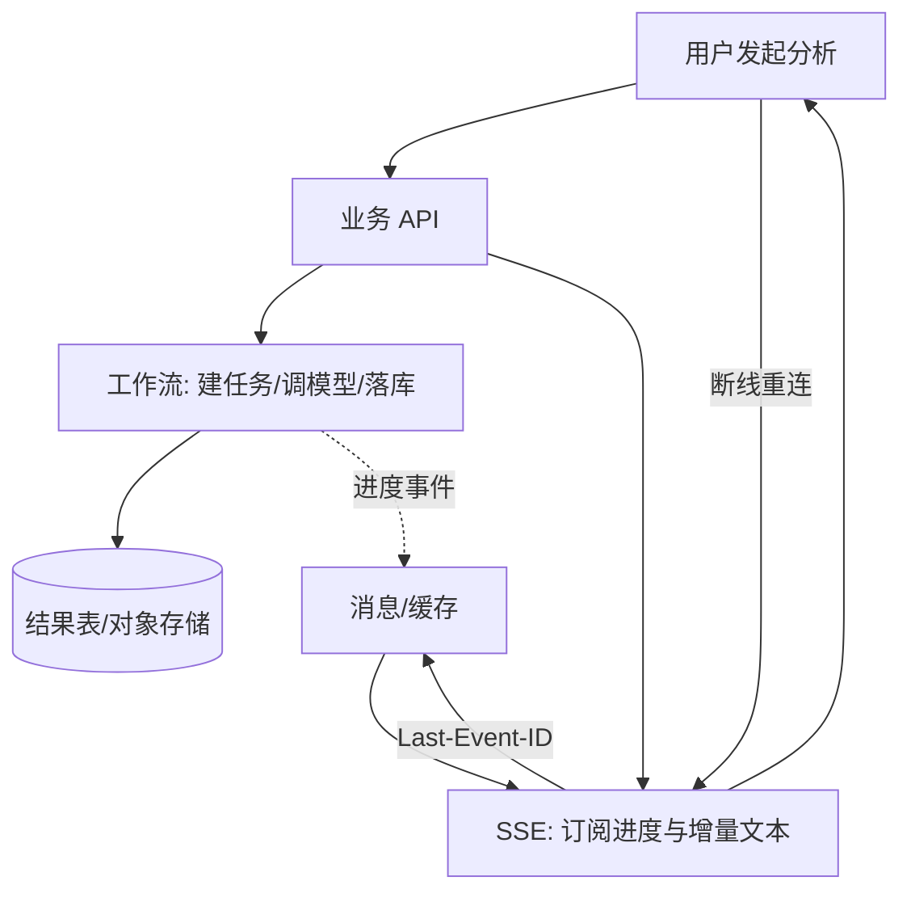
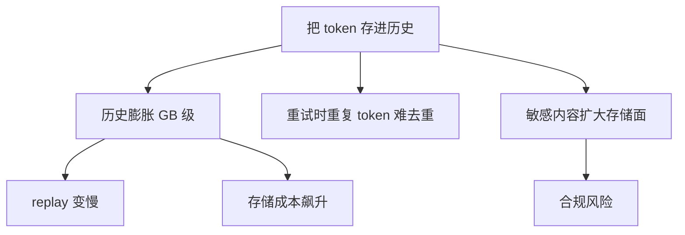
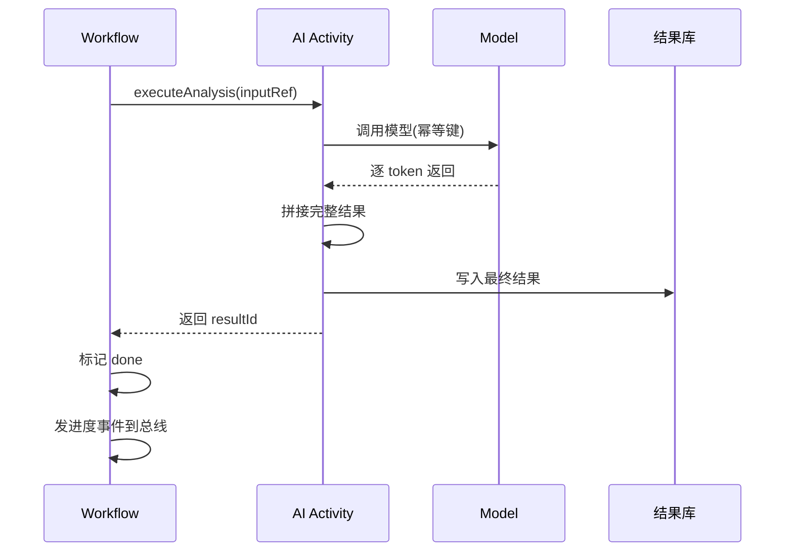
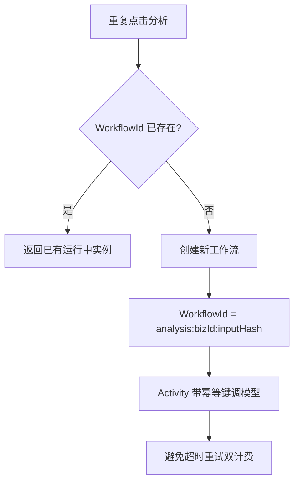
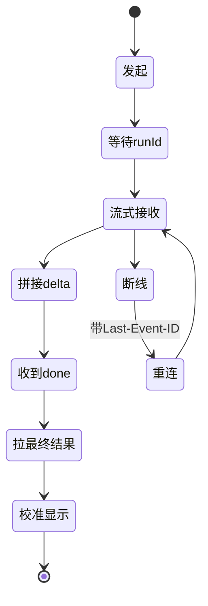

巡检分析、报告生成这类任务，既要 **边生成边展示**，又要 **失败可重试、结果可审计**。若把每个流式 token 都写进工作流历史，体积与重放成本都会爆炸。更干净的切法是：**工作流管可靠结果，SSE 管实时观感**。

## 一、两种需求冲突

| 需求 | 满足方式 | 冲突点 |
|---|---|---|
| 实时展示 | SSE 逐 token 推送 | token 不该进工作流历史 |
| 可靠重试 | 工作流记录状态 | 状态不该包含海量 token |
| 结果审计 | 落库 + 对象存储 | 与 SSE 无直接关系 |

## 二、边界划分



原则：

- **工作流历史**：输入引用、模型版本、最终产物 ID、错误码
- **不进历史**：逐 token 文本、临时调试日志
- **SSE**：从缓存/消息总线读增量；结束帧以「落库成功」为准

## 三、为什么不把 Token 存进工作流



正确做法：把「完整答案」作为 Activity 输出一次写入 DB，SSE 在 `done` 前允许丢包（刷新后以 DB 为准）。

## 四、工作流内部结构



## 五、幂等与防重复



- WorkflowId：`analysis:{bizId}:{inputHash}`
- 同一业务重复点击返回已有运行中实例
- Activity 调用模型时带幂等键，避免超时重试双计费

## 六、前端体验流程



1. 先建任务拿 `runId`
2. 立刻开 SSE
3. 本地拼接 delta；收到 `done` 再拉一次最终结果校准
4. 断线重连从 `Last-Event-ID` 或服务端游标续传

## 七、Activity 伪代码

```ts
async function executeAnalysis(input: AnalysisInput): Promise<string> {
  const idempotencyKey = `${input.taskId}:${input.hash}`;

  const stream = await callModel({
    prompt: input.prompt,
    idempotencyKey
  });

  let fullText = '';
  for await (const chunk of stream) {
    fullText += chunk.text;
    // 进度事件发到总线，不进工作流历史
    await publishProgress(input.runId, chunk);
  }

  // 完整结果落库
  const resultId = await saveResult(input.runId, fullText);
  return resultId; // 只返回 ID 给工作流
}
```

## 八、小结

「流式」满足人，「工作流」满足系统。两者交汇点应是 **进度事件 + 最终落库**，而不是把 token 流塞进工作流引擎。这是巡检 AI、报告生成类功能长期可运维的关键分界。
